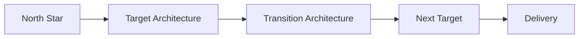

# North Star Architecture: Creating Direction Instead of Destination

Most organizations have strategies, roadmaps, and architecture diagrams.

Yet transformation often stalls.

Projects deliver. Platforms evolve. Teams stay busy.

But the enterprise drifts.

The problem is rarely a lack of architecture.

It is a lack of shared architectural direction.

A North Star Architecture provides that direction. It is not a detailed
future-state blueprint. It is a long-term guide for making consistent
architectural decisions as business priorities, technologies, and
operating models change.

------------------------------------------------------------------------

## Why organizations need a North Star

Without a shared direction, teams optimize locally.

One team modernizes integrations.

Another replaces identity management.

A third adopts a new platform.

Each decision may be reasonable on its own.

Together they increase complexity.

A North Star creates alignment without removing autonomy.

------------------------------------------------------------------------

## The cost of architectural drift

Architectural drift is rarely intentional.

It appears gradually through:

-   Project-by-project decisions
-   Vendor-driven roadmaps
-   Local optimization
-   Short-term delivery pressure
-   Missing architectural principles

Typical symptoms include:

-   Duplicate capabilities
-   Fragmented integration patterns
-   Multiple sources of truth
-   Increasing technical debt
-   Slower delivery over time

A North Star helps prevent drift by providing a consistent direction for
change.

------------------------------------------------------------------------

## North Star vs Target vs Transition Architecture

  -----------------------------------------------------------------------
  Artefact                              Purpose
  ------------------------------------- ---------------------------------
  North Star                            Long-term architectural direction

  Target Architecture                   Planned destination for a
                                        specific planning horizon

  Transition Architecture               Intermediate state enabling
                                        controlled change
  -----------------------------------------------------------------------

Target Architectures change.

Transition Architectures disappear.

The North Star should continue guiding decisions.

------------------------------------------------------------------------

## Designing a North Star

Start with business outcomes.

Not technology.

Consider:

-   Strategic priorities
-   Business capabilities
-   Information flows
-   Platform strategy
-   Security
-   Governance
-   Operating model

Then define architectural principles that are stable enough to survive
technology changes.

Examples include:

-   APIs before point-to-point integrations.
-   Security by design.
-   Automate repetitive work.
-   Prefer platform capabilities over custom development where
    appropriate.
-   Design for observability.

The goal is architectural intent rather than implementation detail.

------------------------------------------------------------------------

## The Role of Enterprise Design

Architecture should not exist in isolation.

Enterprise Design reminds us that architecture serves the
enterprise---not the other way around.

Approaches such as EDGY encourage architects to balance:

-   Identity
-   Experience
-   Architecture

A North Star should therefore support business purpose and desired
experiences, not simply describe future technology.

------------------------------------------------------------------------

## Keeping the North Star Alive

Publishing the document is only the beginning.

A North Star should influence:

-   Investment decisions
-   Portfolio management
-   Architecture reviews
-   Platform evolution
-   Governance
-   Solution design

If it is never referenced during decision-making, it has little value
regardless of how well it is documented.

------------------------------------------------------------------------

## Common Architecture Anti-Patterns

### Technology-first architecture

Technology becomes the strategy.

Instead of enabling business outcomes, architecture becomes a collection
of products.

### Roadmap-driven architecture

Roadmaps answer *when*.

Architecture answers *why this direction*.

Both are necessary.

Neither replaces the other.

### Repository-driven architecture

Documentation grows.

Decision quality does not.

Architecture should improve decisions, not repositories.

### Project-led architecture

Every project creates its own future state.

The enterprise ends up with many futures but no shared direction.

------------------------------------------------------------------------

## From Direction to Delivery

A North Star is intentionally abstract.

Execution requires additional artefacts.

These include:

-   Target Architectures
-   Transition Architectures
-   Capability Maps
-   Principles
-   Roadmaps
-   Reference Architectures
-   Governance

For a practical implementation model, continue with:

**From North Star to Delivery: An Architecture Playbook for Continuous
Change**

The two articles complement each other.

This article explains direction.

The playbook explains execution.

------------------------------------------------------------------------

## Practical Questions

Before approving a North Star, ask:

-   Does it start with business outcomes?
-   Does it describe enduring principles?
-   Will it remain relevant in five years?
-   Does it influence investment decisions?
-   Can solution architects use it every day?

If the answer is no, continue refining it.

------------------------------------------------------------------------

## Final Thoughts

Organizations do not need more architecture documentation.

They need clearer architectural direction.

A North Star Architecture creates coherence across decisions,
investments, and delivery.

Technology will change.

Platforms will change.

Strategies will evolve.

Direction should endure.

> A roadmap tells you what to build next. A North Star tells you how to
> think about everything you build.
