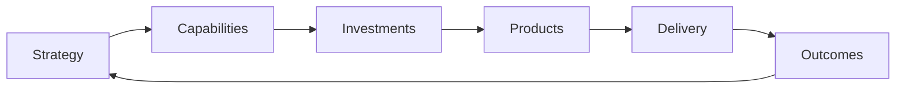
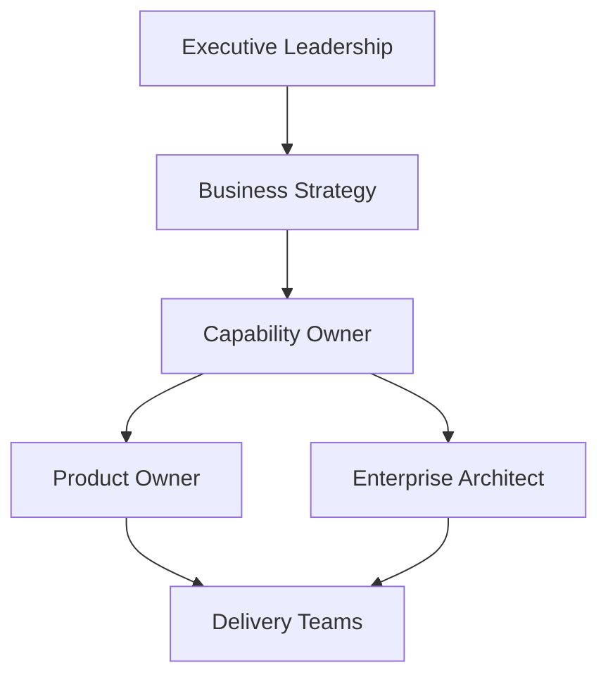

Organizations frequently organize change around projects, products, or organizational structures.
Each approach has advantages.
Each also has limitations.
Projects end.
Products evolve.
Organizations reorganize.
Business capabilities, however, remain remarkably stable.
> A capability-centric operating model organizes change around what the business must be able to do rather than how the organization happens to be structured today.

## Why Capabilities?
Capabilities describe **what** an organization needs to do.
They deliberately avoid describing **who** performs the work or **how** it is implemented.
Examples include:
- Customer Management
- Order Management
- Billing
- Identity Management
- Risk Management

Unlike projects, products, and organizational structures, capabilities tend to survive reorganizations, technology replacements, and leadership changes.
That stability makes them an excellent foundation for long-term planning and investment.

## Capabilities Connect Strategy to Delivery
One of the greatest strengths of capability-centric thinking is that it creates traceability across the enterprise.

Instead of asking:
> Which project supports this strategy?
Organizations begin asking:
- Which capabilities require investment?
- Which capabilities create competitive advantage?
- Which capabilities are underperforming?
- Which capabilities should be modernized?

The conversation shifts from solutions to business outcomes.

## Decision Rights Matter More Than Organizational Structure
Many organizations assign capability ownership without giving capability owners meaningful authority.
The result is accountability without influence.
Capability owners should have clearly defined decision rights.
For example, they may be responsible for:
- Prioritizing capability investments
- Defining strategic objectives
- Approving capability roadmaps
- Setting capability priorities
- Accepting strategic trade-offs
- Measuring capability performance
- Escalating cross-domain dependencies
At the same time, they should **not** decide:
- Technical implementation details
- Sprint priorities
- Team composition
- Low-level solution design

Those decisions belong closer to delivery.
A capability-centric operating model works because decision rights are distributed to the appropriate level.

## Capability Owners Are Not Product Owners
Capability ownership and product ownership complement one another.
A capability owner looks across multiple products and focuses on long-term business outcomes.
A product owner maximizes the value of an individual product.

| Capability Owner | Product Owner |
|------------------|---------------|
| Owns a business capability | Owns a product or service |
| Long-term strategic focus | Short-term delivery focus |
| Prioritizes investments | Prioritizes backlog |
| Measures business outcomes | Measures product outcomes |
| Coordinates multiple products | Optimizes a single product |

Neither role replaces the other.
Together they connect enterprise strategy with product delivery.

## Architecture Supports Better Decisions
Enterprise architecture becomes significantly more valuable when aligned with capability ownership.
Instead of reviewing individual solutions in isolation, architects support capability owners by answering questions such as:
- Should this capability be modernized or replaced?
- Are we duplicating functionality?
- Which platforms should be reused?
- Which capabilities are strategic differentiators?
- Which investments reduce enterprise complexity?

Architecture becomes a decision-support capability rather than an approval function.

## Funding Should Follow Capabilities
Traditional budgeting allocates funding to projects.
Capability-centric organizations increasingly allocate funding to strategic capabilities.
This changes the conversation from:

> Which project should receive funding?
to:
> Which capability requires investment to achieve our strategic objectives?

Projects become temporary implementation vehicles.
Capabilities become long-term investment portfolios.

## An Example Operating Model
A simplified capability-centric operating model might look like this.

Responsibilities are intentionally separated.
- Executive leadership defines strategic priorities.
- Capability owners decide where to invest.
- Enterprise architects provide principles, guardrails, and long-term direction.
- Product owners prioritize product delivery.
- Delivery teams determine how solutions are implemented.

Everyone has clear responsibilities.
Everyone has appropriate decision rights.

## Governance Focuses on Outcomes
Traditional governance often reviews projects.
Capability-centric governance reviews outcomes.
Typical questions include:
- Is this capability improving?
- Are investments aligned with strategy?
- Are we reducing duplication?
- Are customers seeing measurable improvements?
- Are technology risks decreasing?

Governance shifts from approving work to measuring progress.

## Challenges
Capability-centric operating models are not without challenges.
Organizations often struggle with:
- Defining capability ownership
- Assigning meaningful decision rights
- Funding capabilities across organizational boundaries
- Measuring capability maturity
- Coordinating multiple product teams
- Balancing local autonomy with enterprise priorities

These challenges are organizational rather than technical.
They require executive sponsorship, governance, and a shared understanding of accountability.

## When Does It Make Sense?
Capability-centric operating models are particularly effective when organizations:
- Operate multiple product teams
- Invest continuously rather than through projects
- Undergo frequent organizational change
- Need stronger alignment between strategy and execution
- Want enterprise-wide investment prioritization

Smaller organizations may not require a formal capability model, but the principles remain valuable.

## Final Thoughts
Projects are temporary.
Products evolve.
Organizations reorganize.
Capabilities endure.
That stability makes business capabilities a powerful organizing principle for enterprise change.
A capability-centric operating model doesn't replace product management, agile delivery, or enterprise architecture.
It connects them.
When strategy, governance, funding, architecture, product management, and delivery are all aligned around business capabilities, organizations are better equipped to adapt continuously rather than transform occasionally.
Ultimately, capability-centric operating models are not about changing organizational structures.
They are about creating clarity.
Clarity of ownership.
Clarity of governance.
Clarity of investment.
And, most importantly, clarity of decision rights.