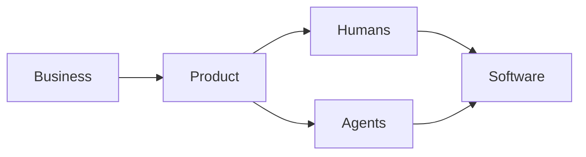
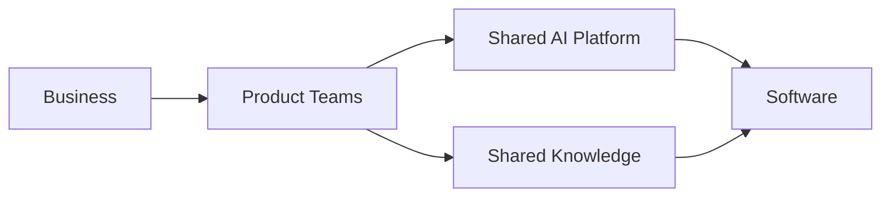

Conway's Law is one of the most influential observations in software architecture.

> Organizations design systems that mirror their communication structures.

For decades, it has helped explain why software architecture often reflects organizational boundaries.
But AI introduces an interesting question.
What happens when software is no longer designed, documented, and operated solely by humans?

## Conway's Law Still Holds

At first glance, nothing changes.
Organizations still define strategy.
People still make decisions.
Teams still communicate.
Software architecture will continue to reflect those communication structures.
Conway's Law remains remarkably relevant.

## But the Organization Is Changing

The interesting question is not whether AI changes software.
It is whether AI changes the organization itself.
Increasingly, teams work alongside AI assistants.

> Developers use coding agents.
> Architects use AI to explore alternatives.
> Product Owners refine requirements with AI.
> Business analysts generate documentation with AI.

Communication patterns are beginning to change.

## Humans Are No Longer the Only Participants

Traditional software delivery looks something like this.

Increasingly, it may look more like this.

AI agents are not organizational actors in the same legal or accountable sense as people.
Yet they increasingly participate in the flow of work, including analysis, design, implementation, testing, documentation, and operations.
That changes how work happens.

## AI May Change Organizational Boundaries

Conway's Law is often discussed in terms of teams and communication paths.
If AI changes how work is distributed, it may also influence where organizational boundaries are drawn.
Some responsibilities that previously required coordination between teams may increasingly be handled through shared AI capabilities.

For example:

- Product teams may use common AI agents for analysis, testing, and documentation.
- Platform teams may provide shared models, prompts, retrieval services, and guardrails.
- Architects may work across domains through shared knowledge rather than repeated meetings.
- Business users may interact directly with systems through AI interfaces.
- Smaller teams may take responsibility for a broader part of the value stream.

This could reduce some dependencies while creating new ones.
Teams may become less dependent on one another for routine coordination, but more dependent on shared data, models, platforms, and knowledge.
Organizational boundaries may therefore shift from teams and reporting lines toward shared platforms, knowledge sources, data products, guardrails, and decision rights.

AI may not remove organizational boundaries.
It may redraw them around shared context, platforms, and decisions.

## Communication Expands into Shared Context

Conway's Law has traditionally been interpreted through human communication structures.
AI introduces something broader.
People no longer communicate only with one another.
They increasingly communicate through documentation, models, platforms, and shared knowledge.

Architectural decisions, business terminology, operating models, capability maps, architecture principles, and API documentation become shared context for both humans and AI.
Communication increasingly flows through knowledge rather than conversations alone.

## Documentation Becomes Strategic

One common misconception is that AI reduces the need for documentation.
The opposite may be true.

As AI becomes part of everyday work, documentation becomes one of an organization's most valuable assets.
A wiki is no longer just documentation for people.
It becomes context for AI.

> Enterprise search, retrieval-augmented generation, coding assistants, architecture copilots, and internal AI agents all depend on structured, trustworthy information.

The quality of AI-generated answers increasingly depends on the quality of the organization's knowledge.
This changes the role of architecture documentation.

Architecture principles, decision records, capability maps, reference architectures, standards, and operating models are no longer static documents.
They become part of the organization's information flow.
In an AI-enabled enterprise, documentation is not a by-product of delivery.
It becomes infrastructure.

## Information Architecture Matters More Than Ever

Organizations have spent years investing in software architecture.
AI increases the importance of another discipline.

Information architecture.

Questions become:

- Can AI discover the information?
- Is terminology consistent?
- Is knowledge connected?
- Who owns the documentation?
- Can AI trust the source?
- Is the information current?

Poor documentation creates poor AI.
Well-structured knowledge creates better decisions.

## Decision Rights Become Even More Important

Despite these changes, one thing remains constant.
AI can suggest.
Humans decide.

Organizations must still determine:

- Who owns architectural decisions?
- Who accepts risk?
- Who prioritizes investments?
- Who governs AI?
- Who is accountable for outcomes?

As AI capabilities increase, decision rights become more important, not less.

## A New Interpretation of Conway's Law?

Perhaps Conway's Law does not need to change.
Perhaps our understanding of an organization does.

Tomorrow's organization may consist of:

- People
- Teams
- Products
- Platforms
- AI agents
- Shared knowledge

Communication structures will evolve.
Software architecture will evolve with them.
The principle remains the same.
The participants change.

## Final Thoughts

AI does not invalidate Conway's Law.
It may, however, change the organization whose communication structures software reflects.
Teams may become smaller.
Boundaries may shift.

Shared AI platforms, knowledge sources, and decision structures may become more important than traditional coordination paths.

Software will still mirror how the organization communicates.
The difference is that communication increasingly flows through people, AI agents, platforms, and shared knowledge.

Architecture documentation, decision records, capability maps, and operating models are therefore no longer passive artefacts.
They actively shape how both humans and AI understand the enterprise.

Perhaps AI does not change Conway's Law.
Perhaps AI changes the organization that Conway's Law describes.