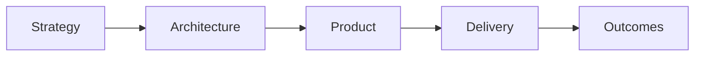
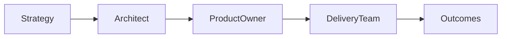

Organizations sometimes debate whether an Architect or a Product Owner should make a particular decision.
The answer depends on the decision itself.
> Architects optimize the system. Product Owners optimize the product.

Understanding this distinction creates clearer governance, faster delivery, and better strategic alignment.

## Different Responsibilities
Architects focus on creating sustainable solutions that align with enterprise objectives.
Product Owners focus on maximizing the value of a product by making prioritization decisions.
Both contribute to successful delivery, but from different perspectives.

## Architects Make Architectural Decisions
Architects typically influence decisions such as:
- Architecture principles
- Target architecture
- Technology direction
- Integration strategy
- Cross-product dependencies
- Platform selection
- Technical guardrails

The goal is to optimize the system as a whole.

## Product Owners Make Product Decisions
Product Owners typically decide:
- Product vision
- Product roadmap
- Backlog priority
- Sprint objectives
- Feature sequencing
- Customer trade-offs
- Release priorities

The goal is to maximize customer and business value.

## Decision Rights Matter
The confusion rarely comes from responsibilities.
It comes from unclear decision rights.

| Architect | Product Owner |
|-----------|---------------|
| Defines architectural guardrails | Prioritizes product backlog |
| Recommends technology direction | Decides what to build next |
| Optimizes across products and platforms | Optimizes a specific product |
| Balances long-term sustainability | Balances short-term customer value |
| Governs architecture | Governs product priorities |

When both roles understand their decision rights, conflict becomes collaboration.

## Working Together
The relationship is complementary rather than hierarchical.

> The architect provides direction.
> The Product Owner decides priorities within those guardrails.
> The delivery team determines how to implement the solution.

## Final Thoughts
Architects and Product Owners should not compete for ownership.
They own different decisions.
Architects ensure that products fit within a sustainable enterprise architecture.
Product Owners ensure that products deliver maximum value.
Neither role is more important than the other.
The most effective organizations clearly define decision rights and allow each role to focus on the decisions it is best equipped to make.