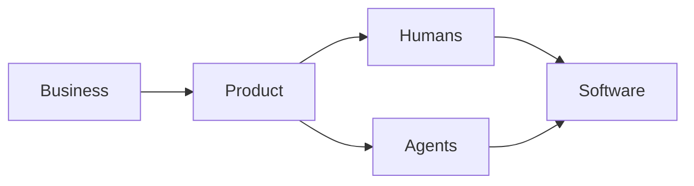

Conway's Law is one of the most influential observations in software architecture.
> Organizations design systems that mirror their communication structures.
For decades, it has helped explain why software architecture often reflects organizational boundaries.
But AI introduces an interesting question.
What happens when software is no longer designed, documented, and operated solely by humans?
## Conway's Law Still Holds
At first glance, nothing changes.
Organizations still define strategy.
People still make decisions.
Teams still communicate.
Software architecture will continue to reflect those communication structures.
Conway's Law remains remarkably relevant.
## But the Organization Is Changing
The interesting question isn't whether AI changes software.
It's whether AI changes the organization itself.
Increasingly, teams work alongside AI assistants.
Developers use coding agents.
Architects use AI to explore alternatives.
Product Owners refine requirements with AI.
Business analysts generate documentation with AI.
Communication patterns are beginning to change.
## Humans Are No Longer the Only Participants
Traditional software delivery looks something like this.

Increasingly, it looks more like this.

AI agents are not employees.
They are not managers.
Yet they increasingly participate in analysis, design, implementation, testing, documentation, and operations.
That changes how work happens.
## Communication Becomes Shared Context
Conway's Law assumes communication between people.
AI introduces something different.
People no longer communicate only with one another.
They also communicate **through documentation**.
Architectural decisions.
Business terminology.
Operating models.
Capability maps.
Architecture principles.
API documentation.
These become shared context consumed by both humans and AI.
Communication increasingly flows through knowledge rather than conversations alone.
## Documentation Becomes Strategic
One common misconception is that AI reduces the need for documentation.
The opposite may be true.
As AI becomes part of everyday work, documentation becomes one of an organization's most valuable assets.
A wiki is no longer just documentation for people.
It becomes context for AI.
Enterprise search.
Retrieval-Augmented Generation (RAG).
Coding assistants.
Architecture copilots.
Internal AI agents.
All depend on structured, trustworthy information.
The quality of AI-generated answers increasingly depends on the quality of the organization's knowledge.
This changes the role of architecture documentation.
Architecture principles.
Decision records.
Capability maps.
Reference architectures.
Standards.
Operating models.
These are no longer static documents.
They become part of the organization's information flow.
In an AI-first enterprise, documentation is not a by-product of delivery.
It becomes infrastructure.
## Information Architecture Matters More Than Ever
Organizations have spent years investing in software architecture.
AI increases the importance of another discipline.
Information architecture.
Questions become:
- Can AI discover the information?
- Is terminology consistent?
- Is knowledge connected?
- Who owns the documentation?
- Can AI trust the source?
Poor documentation creates poor AI.
Well-structured knowledge creates better decisions.
## Decision Rights Become Even More Important
Despite these changes, one thing remains constant.
AI can suggest.
Humans decide.
Organizations must still determine:
- Who owns architectural decisions?
- Who accepts risk?
- Who prioritizes investments?
- Who governs AI?
- Who is accountable for outcomes?
As AI capabilities increase, decision rights become even more important.
## A New Interpretation of Conway's Law?
Perhaps Conway's Law doesn't need to change.
Perhaps our understanding of an organization does.
Tomorrow's organization may consist of:
- People
- Teams
- Products
- Platforms
- AI agents
- Shared knowledge
Communication structures will evolve.
Software architecture will evolve with them.
The principle remains the same.
The participants change.
## Final Thoughts
AI doesn't invalidate Conway's Law.
It expands the environment in which it operates.
Software will continue to reflect how organizations communicate.
The difference is that communication increasingly occurs through shared knowledge consumed by both people and AI.
Perhaps the most important architectural asset in an AI-first organization isn't another platform.
It is trustworthy information.
Architecture documentation, decision records, capability maps, and operating models are no longer passive documents.
They actively shape how both humans and AI understand the enterprise.
Perhaps AI doesn't change Conway's Law.
Perhaps AI changes what an organization is.