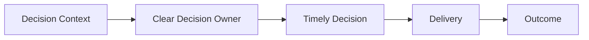
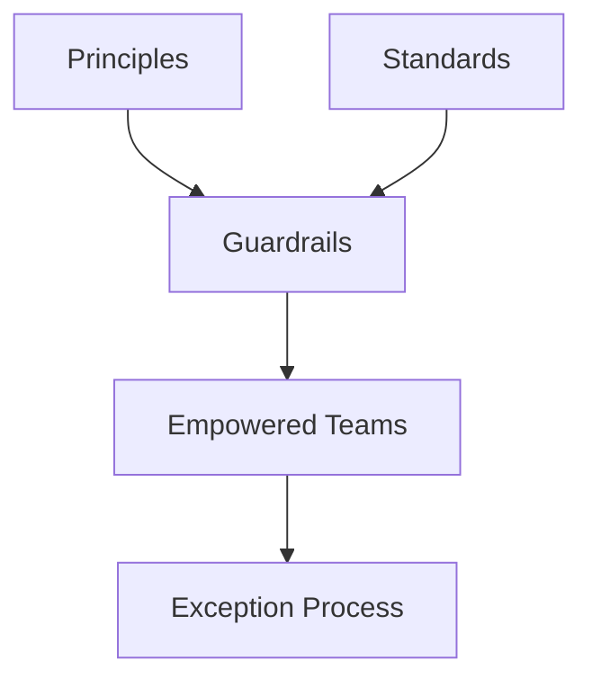

Many organizations remove governance in the name of speed.

- Architecture reviews disappear.
- Approval forums are dissolved.
- Decision gates are eliminated.

The intention is good.
Move faster.
Empower teams.
Reduce bureaucracy.
But removing structure is not the same as removing bottlenecks.

> Don't confuse order with bottlenecks.

## Bottlenecks Are About Decisions

A bottleneck exists when work cannot progress because a required decision cannot be made.

That bottleneck may be:

- A single overloaded architect
- An unavailable manager
- An unclear Product Owner
- Conflicting priorities
- Missing ownership
- A decision that has no defined forum or owner

The problem is rarely the existence of governance itself.
The problem is how decisions are made.
Governance becomes a bottleneck when decisions are centralized unnecessarily, decision rights are unclear, or every issue follows the same approval path regardless of impact.

## Governance Should Create Flow

Good governance should not slow organizations down.
It should enable predictable decision-making.

When decision rights are clear:

- Teams know who decides
- Escalations become exceptions
- Dependencies become visible
- Decisions become repeatable
- Trade-offs are made at the appropriate level

Governance should increase flow, not reduce it.

The faster the right decisions are made, the faster value can be delivered.

## Removing Governance Creates Different Bottlenecks

Organizations sometimes celebrate removing architecture reviews or decision forums.

Six months later they discover:

- Duplicate platforms
- Conflicting APIs
- Inconsistent security controls
- Multiple sources of truth
- Unmanaged dependencies
- Expensive rework

The bottleneck did not disappear.
It moved downstream.
What initially looked like speed created delay later through duplication, integration complexity, security remediation, and architectural debt.
Removing governance can therefore improve local flow while reducing enterprise flow.

## Not Every Decision Needs the Same Governance

A common governance failure is treating every decision as equally important.
A team should not need enterprise approval to select an implementation detail within agreed guardrails.
Introducing a new strategic platform, customer master, identity provider, or enterprise integration pattern is different.
Those decisions may create long-term dependencies across products, teams, and business domains.
The amount of governance should therefore reflect the scope and reversibility of the decision.

| Decision Type | Typical Decision Level |
|---|---|
| Implementation detail within guardrails | Delivery team |
| Product functionality and priority | Product Owner |
| Domain architecture and shared dependencies | Domain or solution architecture |
| Strategic platforms and enterprise standards | Enterprise architecture and management |
| Business risk acceptance | Accountable business owner |

The goal is not to escalate more decisions.
The goal is to escalate the right decisions.

## Optimize Decision Rights

Instead of asking:

> How do we remove governance?

Ask:

> Which decisions belong at which level?

Some decisions should be made by delivery teams.
Others are product decisions.
Some require coordination across products or domains.
A smaller number belong at the enterprise level.
The objective is not centralized control.
The objective is to distribute decisions to the lowest responsible level.
This does not mean pushing every decision downward.
It means placing each decision where the necessary context, competence, authority, and accountability exist.

## Guardrails Reduce the Need for Approval

The alternative to centralized approval is not the absence of control.
It is clear guardrails.

Guardrails define:

- Which decisions teams can make independently
- Which standards must be followed
- Which risks require escalation
- Which technologies are supported
- Which exceptions must be documented
- Which decisions affect the wider enterprise

When teams understand the boundaries, they spend less time asking for permission.
Architecture becomes less about reviewing every decision and more about creating the conditions for good decisions to be made locally.

## Good Architecture Enables Speed

Architecture should reduce friction.
Not by approving everything.

But by providing:

- Clear principles
- Shared standards
- Reusable platforms
- Reference architectures
- Decision guardrails
- Explicit exception paths

Good architecture creates order before delivery reaches a bottleneck.
It reduces repeated discussions and helps teams avoid solving the same enterprise problems independently.

## Measure Decision Flow

Governance should be evaluated by how well decisions flow through the organization.

Useful questions include:

- How long does it take to make a decision?
- How many decisions require escalation?
- How often are decisions reopened?
- Are teams clear about who owns each decision?
- How much rework results from late decisions?
- Are governance forums handling strategic questions or routine details?

If governance repeatedly delays low-risk decisions, it is too centralized.
If teams repeatedly create enterprise-wide problems independently, it is too weak.
The goal is a decision system that balances autonomy with coordination.

## Final Thoughts

Order is not bureaucracy.
Governance is not delay.
Architecture is not automatically the bottleneck.
Poor decision-making is.
The fastest organizations are rarely those with the fewest governance mechanisms.

They are the ones where:

- Decision rights are clear
- Guardrails are understood
- Authority matches accountability
- Strategic decisions receive appropriate attention
- Routine decisions remain close to delivery

Good governance does not remove autonomy.
It makes autonomy scalable.