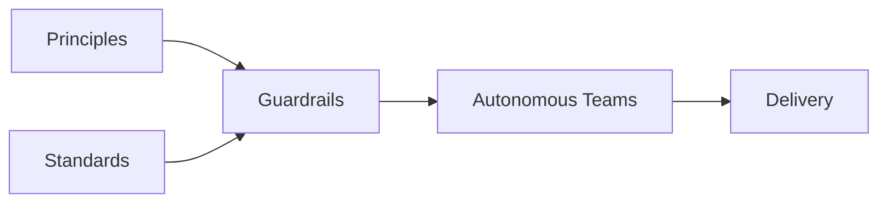
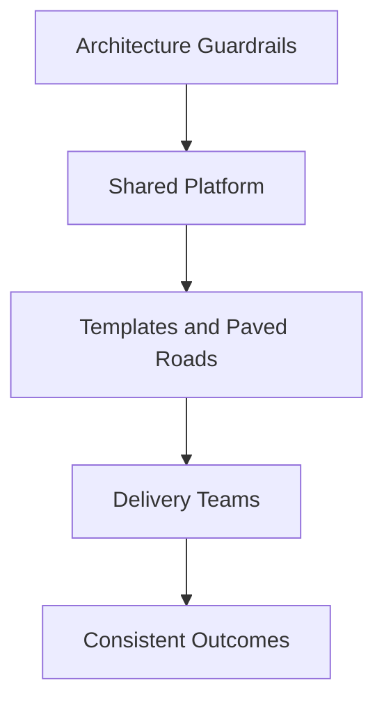

Organizations often want two things at the same time.

- Consistency.
- Autonomy.

They want teams to move quickly, but they also want solutions to remain secure, maintainable, and aligned with enterprise direction.

The usual response is to create approval gates.

Teams prepare material.

Architects review it.

A forum approves or rejects it.

This may create control.

It does not always create flow.

> Gates control decisions before work can continue. Guardrails define the boundaries within which teams can decide for themselves.

The difference matters.

## Gates Create Decision Queues

A gate requires work to stop until someone approves it.

This may be appropriate when the decision is difficult to reverse, carries significant risk, or affects the wider enterprise.

But when every decision becomes a gate, governance creates queues.

Teams wait for:

- Architecture approval
- Security approval
- Platform approval
- Data approval
- Management approval

The organization may appear orderly.

Delivery still slows down.

The problem is not that reviews exist.

The problem is that too many decisions require permission before work can continue.

## Guardrails Enable Local Decisions

Guardrails work differently.

They define the boundaries within which teams can act independently.

A guardrail may state:

- Which technologies are supported
- Which security controls are mandatory
- Which integration patterns should be used
- Which data must remain within a defined jurisdiction
- Which decisions require escalation
- Which risks teams may accept locally

Within those boundaries, teams do not need approval for every choice.

Good guardrails reduce the number of decisions that need central review.

They replace repeated approvals with shared direction.

## Guardrails Are Not the Absence of Governance

Autonomy does not mean that every team can choose anything.

Without boundaries, local decisions can create enterprise-wide consequences.

Teams may introduce:

- Duplicate platforms
- Conflicting integration patterns
- Inconsistent security controls
- Multiple sources of truth
- Unsupported technologies
- Unmanaged operational risk

Guardrails are therefore a form of governance.

They shift governance from individual approval toward predefined constraints.

The goal is not less control.

The goal is control that scales.

## Not Every Decision Needs a Gate

The amount of governance should reflect the impact and reversibility of the decision.

| Decision | Preferred Mechanism |
|---|---|
| Implementation detail within agreed standards | Team autonomy |
| Selection from an approved technology catalogue | Guardrail |
| Exception to an established standard | Exception process |
| Introduction of a new strategic platform | Architecture gate |
| Acceptance of material business risk | Accountable owner decision |
| Enterprise-wide data or identity model | Cross-domain governance |

A team should not need enterprise approval to choose an implementation detail within established guardrails.

Introducing a new customer master, identity provider, or strategic integration platform is different.

Those decisions create long-term dependencies across products and domains.

They may justify a gate.

## The Problem with Too Many Gates

Gates tend to accumulate.

A review is introduced after a failure.

Another approval is added after an audit finding.

A new forum appears after a cross-team conflict.

Each addition may appear reasonable in isolation.

Together they create a governance system where routine work requires repeated escalation.

This produces several problems.

### Decisions Move Away from Context

The people approving the work may not understand the local constraints as well as the team doing the work.

### Accountability Becomes Unclear

Teams may feel that approval transfers responsibility to the review forum.

It does not.

### Reviews Become Superficial

When every initiative requires review, architects spend more time processing volume than examining important decisions.

### Teams Learn to Optimize for Approval

The objective becomes passing the gate rather than making the best decision.

## Good Guardrails Must Be Actionable

A principle such as:

> Prefer reusable solutions.

is not enough.

Teams still need to interpret what reuse means, when it applies, and what happens when reuse creates unnecessary complexity.

A useful guardrail should be:

- Clear
- Specific
- Testable where possible
- Connected to a risk or objective
- Owned
- Reviewable
- Supported by an exception process

For example:

> Customer-facing APIs must be exposed through the approved API management platform unless an exception is documented and approved by the domain architect.

This tells teams what is expected, when escalation is needed, and who owns the decision.

## Platforms Can Encode Guardrails

The strongest guardrails are often implemented through platforms rather than documents.

Examples include:

- Approved infrastructure templates
- Secure deployment pipelines
- Standard observability components
- Identity and access management services
- API gateway policies
- Data classification controls
- Reusable reference implementations

A paved road makes the preferred approach easier than the alternatives.

This is more effective than asking every team to interpret a policy independently.

## Exceptions Are Necessary

No guardrail fits every situation.

Organizations need a clear way to handle exceptions.

A good exception process should answer:

- What is being deviated from?
- Why is the exception necessary?
- Which risks are introduced?
- Who accepts those risks?
- Is the exception temporary or permanent?
- When should it be reviewed?
- What would be required to return to the standard?

Exceptions are not evidence that governance has failed.

They are evidence that the organization recognizes context.

The failure occurs when exceptions remain undocumented, unowned, or permanent by default.

## Decision Rights Make Guardrails Work

Guardrails only help when decision rights are clear.

Teams need to know:

- Which decisions they own
- Which decisions require consultation
- Which decisions require approval
- Who can grant an exception
- Who accepts residual risk
- Who can change the guardrail

Without this clarity, guardrails become suggestions.

Or worse, they become hidden gates because teams still need to ask for informal permission.

Architecture governance should therefore define both boundaries and authority.

## Architecture Should Design the Decision System

Architecture is often treated as the function that reviews solutions.

A stronger role is to design the system through which architectural decisions are made.

That includes:

- Principles
- Standards
- Guardrails
- Reference architectures
- Paved roads
- Decision rights
- Exception paths
- Escalation mechanisms

The objective is not to place architects in every decision.

It is to create an environment where good decisions can be made without them.

## Final Thoughts

Gates are sometimes necessary.

They protect the organization from decisions that are difficult to reverse, carry significant risk, or create enterprise-wide consequences.

But gates should be the exception, not the default.

Guardrails allow teams to move quickly while remaining aligned with shared direction.

They create autonomy without abandoning coordination.

The goal of architecture governance is not to approve every decision.

It is to make more decisions safe to decentralize.

> Gates scale control. Guardrails scale autonomy.
