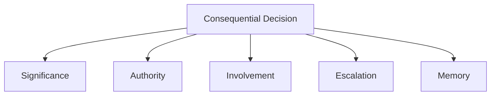
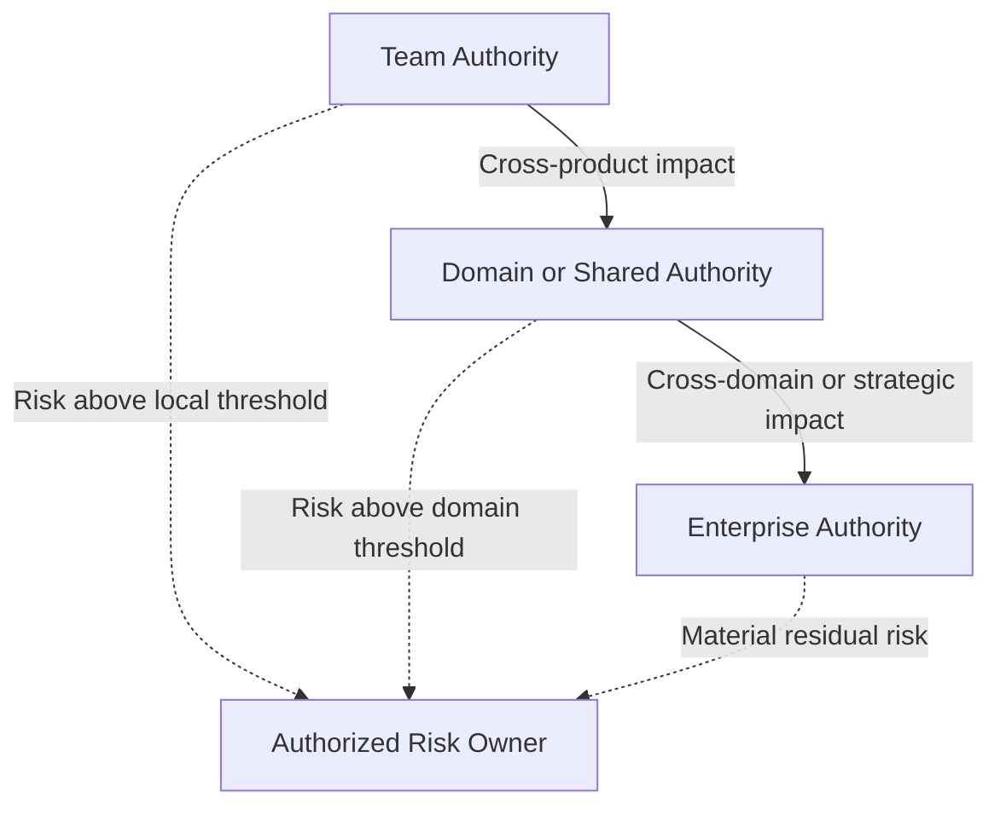

Architecture is shaped by many decisions that are never labeled as architecture decisions.

A product team introduces a local data store because the shared platform cannot meet a delivery date. Management funds a customer-facing capability but postpones the supporting platform work. Security mandates a control after an incident. A business owner accepts a resilience risk to avoid delaying a launch.

None of these decisions may appear in an architecture repository. Yet each can create dependencies, boundaries, standards, and constraints that remain long after the immediate problem has passed.

Architecture is usually documented through systems, platforms, integrations, capabilities, and target states. These views are useful, but they mainly show what exists. They rarely show who had the authority to create it, who accepted the trade-offs, or who can change it now.

By decision architecture, I mean how authority, involvement, accountability, escalation, and organizational memory are distributed around consequential decisions.

Explicit decision rights clarify who can decide, who must contribute, who is accountable for the outcome, and where a decision goes when it exceeds the current mandate.[^weill-ross]

**Note:** The examples in this article are illustrative rather than prescriptive. The same decision may belong to different roles in different organizations, depending on structure, maturity, regulation, competence, and operating model.
{: .notice--info}

## Architecture Emerges Through Decisions

Every architecture reflects a history of decisions.

Some were deliberate and carefully governed. Others were made locally to meet a deadline, recover from an incident, satisfy a customer, or work around a constraint.

A team may introduce a second customer record because the existing source is slow to change. The temporary solution works, the product ships, and the workaround gradually becomes part of the operating model. Two years later, several teams depend on it and nobody is certain who can retire it.

Over time, decisions like these determine which platforms become shared, which technologies remain supported, where data ownership sits, and which dependencies teams have to live with.

They also raise questions that diagrams alone cannot answer:

- Which platforms should be shared?
- Which technologies should be supported?
- Who owns customer data?
- Which risks can a team accept locally?
- When does a product decision become an enterprise decision?

Not every decision involving technology is architecturally significant. Choosing between two supported test libraries is different from introducing a new identity provider or creating another source of truth for customer data.

A decision becomes architecturally significant when it creates consequences beyond the immediate task. It may establish a long-term dependency, affect several teams, change an important boundary, introduce material risk, create a precedent, or become difficult and expensive to reverse.

Governance should reflect those consequences, not simply the fact that technology is involved.

> The wider the impact and the harder the decision is to reverse, the more explicit its decision authority should be.

## Unclear Decision Rights Create Hidden Gates

Organizations often claim to have autonomous teams.

In practice, a team planning a new integration may still need to discover whether the API owner, security architect, domain architect, platform team, or architecture board can stop the work. Nobody has formally asked for five approvals, but the team seeks them anyway because it does not know whose objection could appear later.

The questions are familiar:

- Can we use this technology?
- Who approves this integration?
- Can we introduce a new data store?
- Who owns this API?
- Is architecture approval required?
- Who accepts the risk?
- Which forum should decide?

When the answers are unclear, teams search for informal approval. They ask the most senior person available, wait for the next architecture forum, or seek consensus from everyone who might object later.

The formal gate may have disappeared.

The hidden gate remains.

## Advice Is Not Approval

Organizations often blur different forms of involvement.

An architect may recommend a solution without holding final decision authority. A security specialist may identify a risk without being authorized to accept it. A Product Owner may prioritize delivery without being able to override enterprise policy. A manager may approve funding without deciding the technical design.

These distinctions matter:

| Decision role | Meaning |
|---|---|
| Advise | Provide expertise or options |
| Consult | Give input before a decision |
| Recommend | Propose a preferred direction |
| Approve | Confirm that a proposal meets defined conditions |
| Decide | Select the course of action |
| Accept risk | Formally accept residual exposure within delegated authority |
| Execute | Implement the decision |
| Be accountable | Own the outcome and answer for the consequences |

Consider a team proposing a new authentication flow. Security may advise on threats, architecture may recommend a shared identity pattern, and the product team may explain the customer impact. If security can reject the proposal, however, it is not only advising. It holds approval authority for that part of the decision.

Problems emerge when one role believes it is giving input while another believes it is granting permission.

Approval authority is itself a form of decision authority because an approver can prevent the proposed course of action. It should therefore be assigned as deliberately as final decision authority.

## Authority Must Match Accountability

Organizations sometimes make people accountable for outcomes without giving them sufficient authority.

A Product Owner may be accountable for product outcomes but unable to influence platform priorities. An architect may be expected to reduce duplication but have no mandate to challenge competing investments. A delivery team may own reliability targets while being required to use a platform whose roadmap and service levels it cannot influence.

The reverse is equally problematic. A forum may approve a design and then disappear from the consequences.

> The architecture board approved the design.

That statement explains how the proposal passed a checkpoint. It does not tell us who owns the operational risk, who funds remediation, or who answers when the design fails to support the business outcome.

Approval cannot be treated as a harmless administrative step. It changes what can happen and therefore carries decision authority.

Authority, influence, and accountability will rarely align perfectly, but large gaps between them should be visible and deliberate. Accountability without authority creates helplessness, while authority without accountability creates careless governance.

## Different Decisions Belong at Different Levels

Not every decision belongs to the same role or forum.

A team should normally be able to choose how it structures an internal component. A domain-level decision may be needed when several products must agree on how customer consent is represented. Selecting a new enterprise identity provider is broader still because it affects security, integration, cost, migration, and future product choices.

The right level depends on scope, reversibility, risk, cost, strategic importance, regulatory impact, and the number of teams affected.

> Decisions should be made at the lowest responsible level where sufficient context, competence, authority, and accountability exist.

That is not the same as pushing every decision downward. A team may understand its immediate problem better than anyone else while still lacking visibility into wider consequences.

Decision rights should therefore be placed close to the relevant knowledge while authority and control mechanisms remain aligned.[^jensen-meckling]

## The Decision Architecture Lens

For every consequential decision, five questions should be explicit:

1. **Significance**  -  Why does this decision require wider attention?
2. **Authority**  -  Who has the right to make the decision?
3. **Involvement**  -  Who must advise, consult, assess, recommend, approve, accept risk, or execute?
4. **Escalation**  -  What happens when the decision exceeds the current mandate?
5. **Memory**  -  How will the decision, rationale, and conditions be preserved?

## Decision Rights in Practice

The examples below show how decision rights change with scope and consequence.

### Team and Technology Decisions

Most delivery teams should be free to decide how to structure code, implement tests, refactor components, and choose between supported technologies.

A team choosing between two approved logging libraries should not need an enterprise forum. A team introducing a new event-streaming platform because the existing one is inconvenient is making a different kind of decision. The second choice may create new operational skills, support obligations, security controls, and integration patterns for other teams.

A useful distinction is:

| Situation | Typical treatment |
|---|---|
| Choose between supported libraries | Local team decision |
| Select a database from the approved technology catalog | Local decision within guardrails |
| Use an unsupported database for a specific need | Exception with explicit conditions |
| Introduce a new strategic cloud or integration platform | Enterprise-level decision |

### Product Decisions

Product authority concerns customer and business outcomes: which problem to solve, which trade-off to make, what enters the roadmap, and what can wait.

Suppose a Product Manager wants to introduce automated cancellation to reduce service costs. The product decision belongs with product leadership, but the choice may also affect billing, customer data, legal obligations, and contact-center processes. Architecture should expose those consequences without taking ownership of the product backlog.

When a product choice conflicts with enterprise guardrails or creates dependencies outside the product boundary, consultation or escalation becomes necessary.

### Domain and Enterprise Architecture Decisions

Some architectural decisions are too broad for a single product but do not automatically require enterprise-level authority.

Three customer-facing products may, for example, use different definitions of an "active customer." Each definition works locally, but the differences create problems for reporting, service, and integration. Resolving the meaning, ownership, and authoritative source is a domain-level decision because the consequences cross product boundaries.

Other decisions create wider and more durable commitments. Selecting an enterprise identity provider, adopting a strategic platform, establishing technology lifecycle policy, or approving an exception that others may use as a precedent can affect several domains and constrain future choices.

The distinction is mainly one of scope.

Final authority may still sit with technology leadership, management, an investment forum, or another explicitly authorized body. Architecture should make the consequences visible and help place the decision with the role that can actually stand behind it.

### Security and Risk Decisions

Security functions may define mandatory controls, identity requirements, approved cryptographic methods, and logging obligations. Delivery teams implement them, while security or assurance functions may verify compliance.

Risk acceptance is a different decision.

Consider a service that does not meet the required recovery-time objective. The team can explain the implementation, operations can estimate recovery time, architecture can describe dependencies, and security or resilience specialists can assess exposure. None of those roles should automatically accept the remaining business risk.

| Responsibility | Typical role |
|---|---|
| Define mandatory controls | Security or resilience function |
| Implement controls | Delivery team |
| Verify compliance | Security or assurance function |
| Explain architectural consequences | Architecture |
| Fund remediation | Product or management |
| Accept residual business risk | Authorized risk owner |

The risk owner must decide whether the remaining exposure is acceptable within the delegated mandate.

Established risk-management guidance makes a similar distinction between specialist assessment and accountable risk-based decision-making.[^nist-risk-owner]

### Platform Decisions

Platform teams need enough authority to operate their services as products. They should normally control the platform roadmap, supported capabilities, service levels, upgrade strategy, deployment patterns, and self-service interfaces.

A delivery team using the platform should decide how to build within those boundaries.

Tension appears when a platform team makes an enterprise strategy decision through its backlog. For example, it may deprecate a capability used by twenty teams because maintaining it is inconvenient, or add a new vendor service that creates a long-term licensing commitment.

Operating a platform does not automatically grant authority over enterprise platform strategy.

## Shared Decisions Still Need an Owner

Some decisions cannot be made responsibly from a single perspective.

Selecting a strategic platform may require business leadership to explain the outcome, product teams to describe demand, architecture to assess dependencies, security to evaluate exposure, finance to test the economics, procurement to examine the contract, and operations to assess supportability.

This is where organizations often confuse participation with authority. Because many people need to contribute, the decision gradually becomes something that "the group" owns. Meetings continue, concerns accumulate, and nobody is quite sure who can bring the discussion to a close.

A shared process still needs an explicit decision authority. That authority may sit with an individual or a formally mandated body, but participants should understand where input ends and the decision begins.

Approaches such as EDGY can help participants examine the same enterprise through complementary perspectives of identity, experience, and architecture.[^edgy] This improves shared understanding, but it does not replace authority or accountability.

## Decision Rights Enable Autonomy

Autonomy becomes real when teams know what they can decide without asking permission.

A newly formed team may be told that it owns a service end to end. In its first month, however, it discovers that database choices need architecture approval, production access depends on operations, security exceptions go to a monthly forum, and API changes require agreement from an owner nobody can identify.

The team is accountable, but it is not autonomous.

Teams need to know which decisions are theirs, which guardrails apply, when consultation or approval is required, how to request an exception, who can accept risk, and where uncertainty should be escalated.

Without that clarity, teams either wait unnecessarily or act locally and create wider problems.

## Escalation Is Part of the Model

Escalation is sometimes treated as a failure. It is not.

A team may have authority to select technology from an approved catalog but discover that none of the supported options meets a regulatory requirement. Escalation is the correct response because the decision exceeds the team's mandate; it is not evidence that the team lacks autonomy.

A useful escalation path defines the trigger, destination, required information, final authority, expected response time, and how the outcome becomes visible to others.

Risk acceptance does not always need to pass through an enterprise-level authority. It should sit at the level defined by the organization's risk thresholds and delegation model.

Escalation should be predictable. It should not depend on who knows whom.

## Decision Records Create Organizational Memory

Clear decision rights should be complemented by decision records.

Architecture Decision Records provide one lightweight mechanism for preserving architecturally significant decisions, their context, and their consequences.[^nygard-adr]

A decision record should normally identify the decision, authority, context, alternatives, trade-offs, consulted roles, conditions, and review point.

This matters because temporary decisions have a habit of becoming permanent.

A team may receive a six-month exception to use an unsupported database while a platform capability is developed. Two reorganizations later, the platform work has disappeared, the exception has no owner, and new teams assume the database is an approved standard.

Without organizational memory, exceptions turn into precedent and old discussions are repeatedly reopened.

Decision records create continuity and make governance easier to audit, learn from, and improve.

Lightweight review, exception, and decision-record practices are also included in the [Architecture Review & Governance Toolkit](/enterprise%20architecture/architecture-checklist/).

## Decision Rights Should Be Visible

A decision model should not live only in governance documentation. It should be visible where work happens: product playbooks, team onboarding, platform documentation, technology catalogs, exception processes, architecture repositories, and decision records.

A simple table can remove more ambiguity than another governance forum:

| Decision | Decision authority | Required input | Execution |
|---|---|---|---|
| Product backlog priority | Product Owner | Delivery team and architect when relevant | Delivery team |
| New domain integration pattern | Domain authority | Product teams, security, and platform teams | Delivery teams |
| Enterprise platform introduction | Authorized management body | EA, security, finance, procurement, and operations | Platform organization |
| Local implementation detail | Delivery team | Specialist advice when needed | Delivery team |
| Material risk exception | Authorized risk owner | Security, architecture, legal, and business stakeholders | Responsible delivery organization |

Residual risk should be accepted separately by the authorized risk owner whenever it exceeds the decision-maker's delegated threshold.

## Decision Rights Must Evolve

Decision rights are not permanent.

A central architecture function may initially approve every cloud design because teams lack experience and the platform is immature. Later, standard landing zones, automated controls, documented patterns, and stronger team competence may allow most designs to become local decisions.

The movement can also go in the other direction. A product team may initially control its own customer data model. Once several products depend on the same information, domain-level ownership may become necessary.

The question is not whether centralization or decentralization is inherently better. The question is whether the current placement of authority matches organizational capability and the consequences of the decision.

Centralization is more defensible when risk is high, expertise is scarce, coordination is weak, or decisions are difficult to reverse. Decentralization becomes safer when guardrails are clear, platforms encode preferred patterns, teams have sufficient competence, and local choices have limited wider impact.

## The Role of Architecture

Uncertainty often gets redirected to architects.

A team presents two viable options and asks the architect to choose, not because the architect owns the outcome, but because nobody knows who does. Another team asks for "architecture approval" mainly to protect itself from objections that may appear after implementation.

This can make architects influential, but it also turns architecture into a dependency and eventually a queue.

Architects should not become the default owners of every uncertain decision. Their contribution is usually more valuable when they identify architecturally significant choices, expose wider consequences, establish principles and guardrails, facilitate cross-boundary discussions, create escalation paths, and preserve decision context.

Product leaders shape it through priorities. Platform teams shape it through the capabilities they provide and retire. Security functions shape it through mandatory controls. Procurement shapes it through contractual commitments. Delivery teams shape it through local choices that others may later depend on.

The purpose of a strong architecture function is not to own every decision. It is to help the organization make consequential decisions with clearer authority, better context, and fewer hidden dependencies.

## Final Thoughts

Architecture diagrams describe structures. They do not show the negotiations, trade-offs, mandates, exceptions, and risk decisions that allowed those structures to emerge.

When authority is unclear, teams wait or search for informal approval. Forums become hidden gates. People may be held accountable for outcomes they cannot influence, while others exercise authority without carrying the consequences.

Clear decision rights do not eliminate disagreement, uncertainty, or poor decisions. They make it easier to see where a decision belongs, who needs to contribute, when it should escalate, and who must ultimately stand behind it.

Architecture is shaped not only through formal architecture work, but through the decisions an organization repeatedly permits, constrains, escalates, and records.

> Who decides shapes the architecture.

## Related Perspectives

The following articles explore adjacent questions about architecture, authority, governance, and organizational decision-making.

### On pettersson.dev

- [Don't Confuse Order with Bottlenecks](/governance/confusing-order-with-bottlenecks/)  -  how apparently orderly governance can create queues and dependencies
- [Roles vs Titles: Why Architecture Depends on Responsibilities, Not Job Names](/governance/roles-vs-titles-architecture/)  -  why responsibilities matter more than formal titles
- [Architecture as a Capability: Why Architecture Is Not a Function](/enterprise%20architecture/architecture-as-a-capability/)  -  architecture as a distributed organizational capability

### External Perspectives

- [Decision Rights Are the Real Architecture](https://medium.com/@sabarish_nair/decision-rights-are-the-real-architecture-b9dbc0f93840)  -  Sabarish Sasidharan Nair on decision rights as an often-hidden organizational structure
- [Decision Architecture: The Missing Layer Between Project Visibility and Control](https://www.linkedin.com/pulse/decision-architecture-missing-layer-between-project-control-guerard-qsxvf)  -  Bertrand Guerard on authority and escalation in project governance
- [Who Owns Enterprise Architecture?](https://www.eatransformation.com/p/who-owns-enterprise-architecture)  -  Eetu Niemi on ownership of architecture work, deliverables, and the architecture that actually emerges
- [Architecture as a Decision System](https://www.linkedin.com/pulse/architecture-decision-system-phil-myint-acidc)  -  Phil Myint on connecting architectural decisions to living records

[^jensen-meckling]: Michael C. Jensen and William H. Meckling, "Specific and General Knowledge, and Organizational Structure," in *Contract Economics*, 1992.

[^nist-risk-owner]: NIST, *Prioritizing Cybersecurity Risk for Enterprise Risk Management*, NIST IR 8286B, 2022.

[^nygard-adr]: Michael Nygard, "Documenting Architecture Decisions," 2011.

[^edgy]: Intersection Group, *Enterprise Design with EDGY*.

[^weill-ross]: Peter Weill and Jeanne W. Ross, *IT Governance: How Top Performers Manage IT Decision Rights for Superior Results*, Harvard Business School Press, 2004.
