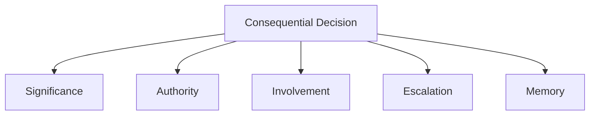
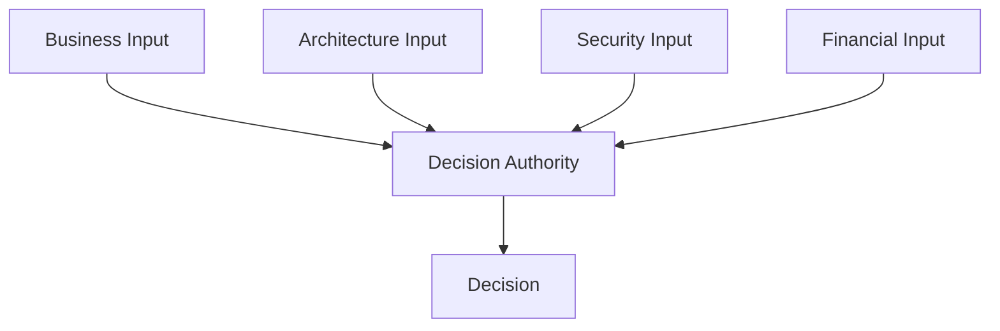
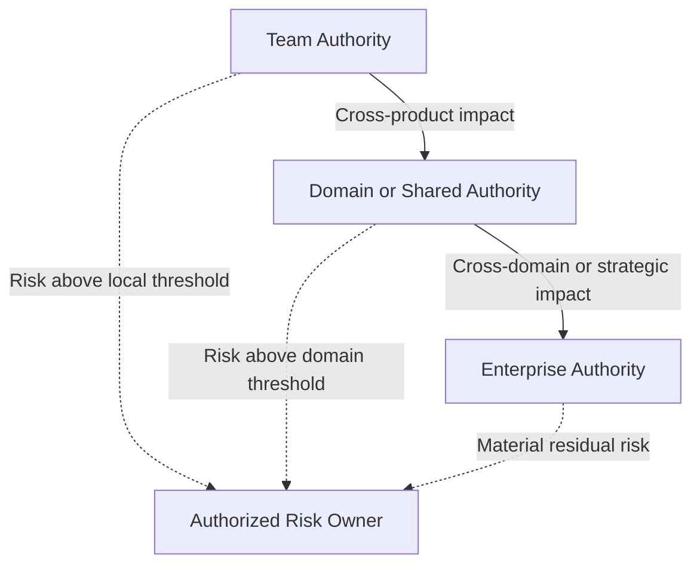

Architecture is shaped by many decisions that are never called architecture decisions.

A product team introduces a new platform.

Management funds one capability rather than another.

Security sets a mandatory control.

A business owner accepts a risk.

Each decision creates dependencies, boundaries, standards, and future constraints.

Architecture is often documented through systems, platforms, integrations, capabilities, and target states.

These views show what exists.

They rarely show who has the authority to shape it.

That pattern of authority, consultation, accountability, and escalation forms a **decision architecture**.

Explicit decision rights make clear who can decide, who must contribute, and where accountability sits.

> Those who make consequential decisions shape the architecture that emerges.

**Note:** The decision-rights examples in this article are illustrative, not prescriptive. Different organizations may assign the same decisions to different roles depending on their structure, maturity, regulatory obligations, and operating model.
{: .notice--info}

## Architecture Emerges Through Decisions

Every architecture reflects decisions.

Which platforms should be shared?

Which technologies are supported?

Who owns customer data?

Which risks can a team accept locally?

When does a product decision become an enterprise decision?

These questions are not answered by diagrams alone.

They require explicit decision authority.

A well-designed operating model connects context, authority, accountability, and execution.

A poorly designed one leaves teams guessing.

Not every decision involving technology is architectural.

A decision becomes architecturally significant when it:

- Creates a long-term dependency
- Affects multiple teams or business areas
- Changes an important boundary
- Introduces material risk
- Establishes a new source of truth
- Creates a precedent others may follow
- Constrains future choices
- Is difficult or expensive to reverse

The governance mechanism should reflect the consequences of the decision, not simply the fact that technology is involved.

## Unclear Decision Rights Create Hidden Gates

Organizations often claim to have autonomous teams.

In practice, teams still ask:

- Can we use this technology?
- Who approves this integration?
- Can we introduce a new data store?
- Who owns this API?
- Is architecture approval required?
- Who accepts the risk?
- Which forum should decide?

When the answer is unclear, teams search for informal approval.

They ask the most senior person available.

They wait for the next architecture forum.

They seek consensus from everyone who might object later.

The formal gate may have disappeared.

The hidden gate remains.

This is one way apparently orderly governance can create queues, dependencies, and bottlenecks rather than effective coordination. See [Don’t Confuse Order with Bottlenecks](/governance/confusing-order-with-bottlenecks/).

## Advice Is Not Approval

One source of confusion is that organizations blur different forms of involvement.

There is an important difference between:

- Advising
- Consulting
- Recommending
- Approving
- Deciding
- Accepting risk
- Executing
- Being accountable

An architect may recommend a solution without holding final decision authority.

A security specialist may identify a risk without being authorized to accept it.

A Product Owner may prioritize delivery without being able to override enterprise policy.

A manager may approve funding without deciding the technical design.

These distinctions matter.

| Involvement | Meaning |
|---|---|
| Advise | Provide expertise or options |
| Consult | Give input before a decision |
| Recommend | Propose a preferred direction |
| Approve | Confirm that a proposal meets defined conditions |
| Decide | Select the course of action |
| Accept risk | Formally accept residual exposure within delegated authority |
| Execute | Implement the decision |
| Be accountable | Own the outcome and answer for its consequences |

Problems emerge when one role believes it is advising while another believes it is approving.

## Authority Must Match Accountability

Organizations sometimes make people accountable for outcomes without giving them sufficient authority.

A Product Owner may be accountable for product outcomes but unable to influence platform priorities.

An architect may be accountable for architectural coherence but unable to address enterprise-wide duplication.

A delivery team may be accountable for reliability while being required to use a platform it does not control.

This creates accountability without influence.

The opposite is also dangerous.

A forum may have authority to approve a proposal without being accountable for its consequences.

For example:

> The architecture board approved the design.

That does not mean the architecture board owns the operational risk, delivery outcome, or business impact.

Authority, influence, and accountability should be deliberately aligned.

## Different Decisions Belong at Different Levels

Not every decision belongs to the same role or forum.

The appropriate level depends on factors such as:

- Scope
- Reversibility
- Risk
- Cost
- Number of affected teams
- Strategic importance
- Regulatory impact
- Long-term dependency

A useful principle is:

> Decisions should be made at the lowest responsible level where sufficient context, competence, authority, and accountability exist.

That is not the same as pushing every decision downward.

Some decisions are inherently broader than a single team.

A team may have the best understanding of its immediate problem while lacking visibility into the wider consequences of its choice.

Decision rights should therefore be placed close to the relevant knowledge while authority and control mechanisms remain aligned.[^jensen-meckling]

## The Decision Architecture Lens

For every consequential decision, five questions should be explicit:

1. **Significance** — Why does this decision require wider attention?
2. **Authority** — Who has the right to make the decision?
3. **Involvement** — Who must advise, consult, assess, recommend, approve, accept risk, or execute?
4. **Escalation** — What happens when the decision exceeds the current mandate?
5. **Memory** — How will the decision, rationale, and conditions be preserved?

A decision model becomes useful when these questions can be answered without relying on informal relationships or organizational guesswork.

## Decision Rights in Practice

The following examples illustrate how decision authority and involvement may vary across different categories of decisions.

The Decision Architecture Lens can then be used to clarify significance, escalation, and memory for each specific case.

The allocation is not universal. What matters is that the boundary between local, shared, and enterprise decisions is explicit.

### Team and Technology Decisions

Delivery teams should typically own decisions such as:

- Internal code structure
- Test implementation
- Refactoring approach
- Internal component design
- Choices between supported technologies

These decisions are close to the work, comparatively easy to reverse, and usually limited in scope.

They should not require enterprise governance.

Technology choices can be treated differently depending on their consequences:

| Situation | Typical treatment |
|---|---|
| A team chooses between supported libraries | Local team decision |
| A team selects a database from the approved technology catalog | Local decision within guardrails |
| A team requires an unsupported technology | Formal exception process |
| The organization considers a new strategic cloud platform | Enterprise decision |

The mechanism should match the impact of the decision.

### Product Decisions

A Product Owner or Product Manager should typically own decisions such as:

- Customer problems and outcomes
- Feature and roadmap priorities
- Release scope
- Product trade-offs
- Acceptance criteria

These are product-value decisions.

Architects may advise on feasibility, risk, dependencies, and long-term consequences, but they should not own the product backlog.

When a product choice creates wider dependencies or conflicts with enterprise guardrails, it may require consultation or escalation.

### Domain Architecture Decisions

A Domain Architect or equivalent may own or facilitate decisions such as:

- Domain integration patterns
- Shared services and data ownership
- Domain target architecture
- Cross-product dependencies
- Domain standards and exceptions

These decisions are broader than one product but may not require enterprise-wide governance.

Domain-level authority can combine local knowledge with accountability for wider coherence.

### Enterprise Architecture Decisions

Depending on the operating model, Enterprise Architecture may hold decision authority for some categories of decision while facilitating or governing others.

These may include:

- Enterprise principles
- Strategic platforms
- Cross-domain standards
- Technology lifecycle policy
- Enterprise-wide exceptions

These decisions create long-term consequences across the organization.

They should not be made independently by whichever team happens to act first.

Final authority may sit with Enterprise Architecture, technology leadership, management, an investment forum, or another explicitly authorized body.

### Security and Risk Decisions

Security functions may define:

- Mandatory controls
- Security standards
- Threat-model requirements
- Approved cryptographic methods
- Identity requirements
- Logging and monitoring obligations

Delivery teams remain responsible for implementing the controls.

Security or assurance functions may verify compliance.

Risk acceptance is a separate decision.

| Responsibility | Typical role |
|---|---|
| Define mandatory security controls | Security |
| Implement the controls | Delivery team |
| Verify compliance | Security or assurance function |
| Explain architectural consequences | Architecture |
| Fund remediation | Management or product leadership |
| Accept residual business risk | Authorized risk owner |

An architect can explain architectural risk.

A security specialist can explain cyber risk.

A privacy specialist can explain regulatory exposure.

But accepting material residual risk belongs to an authorized risk owner who is accountable for its consequences.

For example:

> The solution does not meet the resilience standard and may cause an extended service disruption.

The architect may recommend against deployment.

The risk owner must decide whether the remaining exposure is acceptable.

That decision should be explicit and documented.

Established risk-management guidance makes a similar distinction between specialist assessment and accountable risk-based decision-making.[^nist-risk-owner]

### Data Decisions

Data decision rights often span several roles.

A data owner may decide:

- Access, sensitivity, and acceptable use
- Retention and quality expectations
- Accountability for meaning

A data architect may decide or recommend:

- Canonical models and metadata standards
- Integration patterns and authoritative sources
- Data platform direction

A product team may decide:

- Product-specific use and transformations
- Local views within shared data guardrails

A team should not independently create a competing source of truth for enterprise customer data merely because doing so is locally convenient.

That decision has consequences beyond the product boundary.

### Platform Decisions

Platform teams often sit between autonomy and standardization.

They may own decisions such as:

- Platform roadmap
- Supported capabilities
- Service levels
- Standard deployment patterns
- Upgrade strategy
- Self-service interfaces
- Platform guardrails

Delivery teams should decide how to use the platform within those boundaries.

Enterprise Architecture or management may decide whether the organization needs the platform, whether it should become strategic, and when it should be replaced or retired.

> Operating a platform does not automatically grant authority over the enterprise platform strategy.

Operation, product ownership, architecture, and investment authority are related but distinct responsibilities.

### Vendor and SaaS Decisions

A team may identify a useful SaaS product.

That does not mean the team should necessarily be able to purchase and introduce it independently.

A new SaaS solution may affect:

- Security and privacy
- Identity and integration
- Procurement and legal obligations
- Support and business continuity
- Data ownership
- Architecture complexity

Decision rights may therefore be distributed.

| Activity or decision | Typical role |
|---|---|
| Define the business need | Product or business owner |
| Evaluate product fit | Product team |
| Assess architecture impact | Architect |
| Assess security and privacy | Security and privacy functions |
| Approve contractual terms | Procurement and authorized management |
| Accept residual risk | Authorized risk owner |
| Decide enterprise standardization | Management and Enterprise Architecture |

No single role needs to own every part of the process.

For each consequential decision, authority and accountability must still be explicit.

## Shared Decisions Need Explicit Authority

Some decisions require multiple perspectives.

Selecting a strategic platform may involve:

- Business leadership
- Enterprise Architecture
- Security
- Procurement
- Finance
- Operations
- Product leadership

That does not mean the decision should belong to a vague collective.

A shared process still needs explicit decision authority, whether it sits with an individual role or a clearly defined collective body.

Shared decisions also require shared understanding.

Approaches such as EDGY can help participants examine the same enterprise through complementary perspectives of identity, experience, and architecture.[^edgy]

This does not replace explicit authority or accountability. It improves the context in which the decision is made.

> Shared language informs the decision. Clear decision rights determine who makes it.

## Decision Rights Enable Autonomy

Autonomy is not created by telling teams to move faster.

It is created by making clear what teams can decide without asking permission.

Teams need to know:

- Which decisions are theirs
- Which guardrails apply
- When consultation is required
- When approval is required
- How to request an exception
- Who can accept risk
- Where to escalate uncertainty

Without this clarity, teams either wait unnecessarily or make decisions that create wider problems.

Good decision rights create confident autonomy.

They replace repeated permission-seeking with clear boundaries and predictable escalation.

## Escalation Is Part of the Model

Escalation is sometimes treated as a failure.

It is not.

Some decisions genuinely exceed the authority, competence, or scope of the current decision-maker.

A good escalation model defines:

- What triggers escalation
- Where the decision goes
- What information is required
- Who has final authority
- How quickly the decision should be resolved
- How the outcome is communicated
- Whether the decision creates a new precedent

Risk acceptance does not always need to pass through an enterprise-level authority.

It should sit at the level defined by the organization’s risk thresholds and delegation model.

Escalation should be predictable.

It should not depend on who knows whom.

## Decision Records Create Organizational Memory

Clear decision rights should be complemented by decision records.

Architecture Decision Records provide one lightweight mechanism for preserving architecturally significant decisions, their context, and their consequences.[^nygard-adr]

Records of important decisions should capture:

- The decision
- The decision authority
- The context
- Alternatives considered
- Trade-offs
- Risks
- Consulted roles
- Date
- Review point
- Conditions or exceptions

This matters because people change roles.

Teams reorganize.

Platforms evolve.

Without records, organizations repeatedly reopen old discussions or treat temporary exceptions as permanent policy.

Decision records create continuity and make governance easier to audit, learn from, and improve.

Lightweight review, exception, and decision-record practices are also included in the [Architecture Review & Governance Toolkit](/enterprise%20architecture/architecture-checklist/).

## Decision Rights Should Be Visible

A decision model should not live only in governance documentation.

It should be visible where work happens.

Examples include:

- Product playbooks
- Architecture repositories
- Team onboarding
- Platform documentation
- Governance guidance
- Technology catalogs
- Exception processes
- Architecture Decision Records
- Capability ownership models
- RACI- or RAPID-style decision maps

A simple decision-rights table can often remove more ambiguity than another governance forum.

| Decision | Decide | Consult | Execute |
|---|---|---|---|
| Product backlog priority | Product Owner | Architect and delivery team | Delivery team |
| New domain integration pattern | Domain Architect | Product teams, security, and platforms | Delivery teams |
| Enterprise platform introduction | Authorized management body | EA, security, finance, and operations | Platform organization |
| Local implementation detail | Delivery team | Architect when needed | Delivery team |
| Material risk acceptance | Authorized risk owner | Security, architecture, and business stakeholders | Responsible delivery organization |

The terminology matters less than the clarity.

## Decision Rights Must Evolve

Decision rights are not permanent.

As organizations mature, decisions may move.

A central architecture function may initially approve cloud designs.

Later, standardized platforms, encoded guardrails, and stronger team competence may allow those decisions to become local.

A product team may initially decide its own data model.

Later, cross-product dependencies may require domain-level governance.

The direction can move both ways.

Centralize decisions when:

- Enterprise coordination is weak
- Risk is high
- Standards are immature
- Decisions are difficult to reverse
- Expertise is scarce
- Consequences extend across the enterprise

Decentralize decisions when:

- Guardrails are clear
- Teams have sufficient competence
- Platforms encode preferred patterns
- Decisions are reversible
- Local context matters most
- Wider consequences are limited

Decision rights should reflect current organizational capability rather than an ideology of either centralization or autonomy.

## The Role of Architecture

Architects should not become the default owners of every uncertain decision.

That creates dependency and turns architecture into a queue.

Architects should help:

- Identify architecturally significant decisions
- Establish principles and guardrails
- Expose wider consequences and trade-offs
- Facilitate cross-boundary decisions and predictable escalation
- Preserve important decision context

Architectural influence also extends beyond formal architecture roles.

Product leaders, managers, security functions, delivery teams, procurement functions, and risk owners all shape the architecture through consequential decisions.

> People with consequential decision rights shape the architecture, whether or not they hold a formal architecture role.

This does not make formal architects irrelevant.

It clarifies their purpose.

A strong architecture function does not attempt to own every decision.

It helps the organization establish clear decision authority, guardrails, escalation paths, and shared context for better decisions at the right level.

## Final Thoughts

Architecture diagrams describe structures.

Decision rights explain how those structures are allowed to change.

When authority is unclear, teams wait, forums become hidden gates, and accountability becomes separated from influence.

When authority is explicit, teams can act locally, escalate predictably, and preserve the reasoning behind consequential choices.

Architecture is therefore not shaped only through formal architecture work.

It emerges through the decisions the organization repeatedly permits, constrains, escalates, and records.

> Who decides shapes the architecture.

## Related Perspectives

The following articles explore adjacent questions about architecture, authority, governance, and organizational decision-making.

### On pettersson.dev

- [Don’t Confuse Order with Bottlenecks](/governance/confusing-order-with-bottlenecks/) — how apparently orderly governance can create queues and dependencies
- [Roles vs Titles: Why Architecture Depends on Responsibilities, Not Job Names](/governance/roles-vs-titles-architecture/) — why responsibilities matter more than formal titles
- [Architecture as a Capability: Why Architecture Is Not a Function](/enterprise%20architecture/architecture-as-a-capability/) — architecture as a distributed organizational capability

### External Perspectives

- [Decision Rights Are the Real Architecture](https://medium.com/@sabarish_nair/decision-rights-are-the-real-architecture-b9dbc0f93840) — Sabarish Sasidharan Nair on decision rights as an often-hidden organizational structure
- [Decision Architecture: The Missing Layer Between Project Visibility and Control](https://www.linkedin.com/pulse/decision-architecture-missing-layer-between-project-control-guerard-qsxvf) — Bertrand Guerard on authority and escalation in project governance
- [Who Owns Enterprise Architecture?](https://www.eatransformation.com/p/who-owns-enterprise-architecture) — Eetu Niemi on ownership of architecture work, deliverables, and the architecture that actually emerges
- [Architecture as a Decision System](https://www.linkedin.com/pulse/architecture-decision-system-phil-myint-acidc) — Phil Myint on connecting architectural decisions to living records

[^jensen-meckling]: Michael C. Jensen and William H. Meckling, “Specific and General Knowledge, and Organizational Structure,” in *Contract Economics*, 1992.

[^nist-risk-owner]: NIST, *Prioritizing Cybersecurity Risk for Enterprise Risk Management*, NIST IR 8286B, 2022.

[^nygard-adr]: Michael Nygard, “Documenting Architecture Decisions,” 2011.

[^edgy]: Intersection Group, *Enterprise Design with EDGY*.