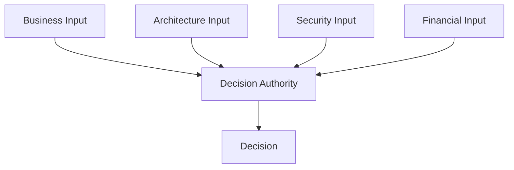

Architecture is often documented through systems, platforms, integrations, capabilities, and target states.

But these descriptions do not show who has the authority to shape them.

This pattern of authority, consultation, accountability, and escalation forms a decision architecture.

> Decision authority reveals how architecture is actually shaped.

**Note:** The decision-rights examples in this article are illustrative, not prescriptive. Different organizations may assign the same decisions to different roles depending on their structure, maturity, regulatory obligations, and operating model.
{: .notice--info}

## Architecture Emerges Through Decisions

Every architecture reflects decisions.

Which platforms should be shared?

Which technologies are supported?

Who owns customer data?

Which risks can a team accept locally?

When does a product decision become an enterprise decision?

These questions are not answered by diagrams alone.

They require explicit decision authority.

A well-designed operating model connects context, authority, accountability, and execution.

A poorly designed one leaves teams guessing.

Not every decision involving technology is architectural.

A decision becomes architecturally significant when it creates long-term dependencies, affects multiple teams, changes important boundaries, introduces material risk, or constrains future choices.

The governance mechanism should reflect the consequences of the decision, not simply the fact that technology is involved.

## Unclear Decision Rights Create Hidden Gates

Organizations often claim to have autonomous teams.

In practice, teams still ask:

- Can we use this technology?
- Who approves this integration?
- Can we introduce a new data store?
- Who owns this API?
- Is architecture approval required?
- Who accepts the risk?
- Which forum should decide?

When the answer is unclear, teams search for informal approval.

They ask the most senior person available.

They wait for the next architecture forum.

They seek consensus from everyone who might object later.

The formal gate may have disappeared.

The hidden gate remains.

## Advice Is Not Approval

One source of confusion is that organizations blur different forms of involvement.

There is an important difference between:

- advising
- consulting
- recommending
- approving
- deciding
- accepting risk
- being accountable

An architect may recommend a solution without owning the final decision.

A security specialist may identify a risk without being authorized to accept it.

A Product Owner may prioritize delivery without being able to override enterprise policy.

A manager may approve funding without deciding the technical design.

These distinctions matter.

| Involvement | Meaning |
|---|---|
| Advise | Provide expertise or options |
| Consult | Give input before a decision |
| Recommend | Propose a preferred direction |
| Approve | Confirm that a proposal meets defined conditions |
| Decide | Select the course of action |
| Accept risk | Take accountability for residual exposure |
| Execute | Implement the decision |

Problems emerge when one role believes it is advising while another believes it is approving.

## Authority Must Match Accountability

Organizations sometimes make people accountable for outcomes without giving them authority.

A Product Owner may be accountable for product outcomes but unable to influence platform priorities.

An architect may be accountable for architectural coherence but unable to stop enterprise-wide duplication.

A delivery team may be accountable for reliability but forced to use a platform it does not control.

This creates accountability without influence.

The opposite is also dangerous.

A forum may have authority to approve a proposal without being accountable for its consequences.

For example:

> The architecture board approved the design.

That does not mean the architecture board owns the operational risk, delivery outcome, or business impact.

Authority and accountability should be deliberately aligned.

## Different Decisions Belong at Different Levels

Not every decision belongs to the same role or forum.

The correct level depends on factors such as:

- Scope
- Reversibility
- Risk
- Cost
- Number of affected teams
- Strategic importance
- Regulatory impact
- Long-term dependency

A useful principle is:

> Decisions should be made at the lowest responsible level where sufficient context, competence, authority, and accountability exist.

That is not the same as pushing every decision downward.

Some decisions are inherently broader than a single team.

This reflects a long-standing principle in organizational design: decision rights should be placed close to the specific knowledge required to make the decision, while authority and control mechanisms must remain aligned.[^jensen-meckling]

## Example: Implementation Decisions

A delivery team should typically own decisions such as:

- Internal code structure
- Naming conventions within the codebase
- Test strategy
- Choice between supported libraries
- Refactoring approach
- Local caching implementation
- Internal component design
- Logging details within agreed standards

These decisions are close to the work, reversible, and usually limited in scope.

They should not require enterprise governance.

## Example: Product Decisions

A Product Owner or Product Manager should typically own decisions such as:

- Which customer problem to solve next
- Feature priority
- Roadmap sequencing
- Release scope
- Product trade-offs
- Acceptance criteria
- Which outcomes to measure
- Whether to defer lower-value functionality

These are product-value decisions.

Architects may advise on feasibility, risk, and long-term implications, but should not own the product backlog.

## Example: Domain Architecture Decisions

A Domain Architect or equivalent may own or facilitate decisions such as:

- Domain-wide integration patterns
- Shared services within the domain
- Domain data ownership
- Domain target architecture
- Retirement of duplicated applications
- Cross-product dependencies
- Domain-specific technology standards
- Architectural exceptions affecting multiple products

These decisions are broader than one product but may not require enterprise-wide governance.

## Example: Enterprise Architecture Decisions

Enterprise Architecture may own, facilitate, or govern decisions such as:

- Enterprise architecture principles
- Strategic platforms
- Enterprise integration standards
- Identity and access direction
- Enterprise data principles
- Technology lifecycle policy
- Approved technology catalogue
- Cross-domain reference architectures
- Enterprise-wide exceptions

These decisions create long-term consequences across the organization.

They should not be decided independently by a single team.

## Example: Security Decisions

Security decision rights are often particularly unclear.

A security team may define:

- Mandatory controls
- Security standards
- Threat-model requirements
- Approved cryptographic methods
- Identity requirements
- Logging and monitoring obligations

But the security team may not hold decision authority for every risk decision.

For example:

| Responsibility | Typical Role |
|---|---|
| Define mandatory security control | Security |
| Implement the control | Delivery team |
| Verify compliance | Security or assurance function |
| Accept residual business risk | Accountable business owner |
| Fund remediation | Management or product leadership |

Security identifies and evaluates risk.

Residual business risk still requires acceptance by an accountable business owner.

## Example: Data Decisions

Data decision rights often span multiple roles.

A data owner may decide:

- Who can access the data
- How sensitive it is
- Required retention
- Acceptable use
- Data quality expectations

A data architect may decide or recommend:

- Canonical models
- Data integration patterns
- Metadata standards
- Data platform direction

A product team may decide:

- How data is used within the product
- How local transformations are implemented
- How product-specific views are created

A team should not independently create a new source of truth for enterprise customer data.

That decision belongs at a broader level.

## Example: Platform Decisions

Platform teams often sit between autonomy and standardization.

They may own decisions such as:

- Platform roadmap
- Supported capabilities
- Service levels
- Standard deployment patterns
- Upgrade strategy
- Self-service interfaces
- Platform guardrails

Delivery teams should decide how to use the platform within those boundaries.

Enterprise Architecture or management may decide whether the organization needs the platform at all.

This avoids a common mistake:

> A platform team should not automatically decide enterprise platform strategy simply because it operates the platform.

Operation, product ownership, architecture, and investment authority are related but distinct.

## Example: Vendor and SaaS Decisions

A team may identify a useful SaaS product.

That does not necessarily mean the team should be able to purchase and introduce it independently.

A new SaaS solution may affect:

- Security
- Data protection
- Identity
- Integration
- Procurement
- Legal obligations
- Support
- Business continuity
- Architecture complexity

Decision rights may therefore be distributed.

| Activity or Decision | Typical Role |
|---|---|
| Define business need | Product or business owner |
| Evaluate product fit | Product team |
| Assess architecture impact | Architect |
| Assess security and privacy | Security and privacy functions |
| Approve commercial agreement | Procurement and accountable manager |
| Accept residual risk | Business owner |
| Decide enterprise standardization | Management and enterprise architecture |

No single role needs to own every part of the process.

For each consequential decision, authority and accountability must still be explicit.

## Example: Technology Selection

Not every technology choice requires the same governance.

### Team-level choice

A team chooses between two already approved libraries.

This should remain local.

### Guardrail-based choice

A team selects a database from the approved technology catalogue.

No additional approval is needed.

### Exception

A team needs an unsupported technology due to a specific requirement.

An exception process is appropriate.

### Enterprise decision

The organization considers introducing a new strategic cloud platform.

This requires broader architecture, security, commercial, and management involvement.

The mechanism should match the impact of the decision.

## Example: Risk Acceptance

Risk acceptance is often incorrectly delegated to technical specialists.

An architect can explain architectural risk.

A security specialist can explain cyber risk.

A privacy specialist can explain regulatory exposure.

But accepting material business risk usually belongs to the accountable business owner.

For example:

> The solution does not meet the resilience standard and may cause extended service disruption.

The architect may recommend against deployment.

The business owner must decide whether the residual risk is acceptable.

That decision should be explicit and documented.

Established risk-management guidance makes a similar distinction: specialists may assess and recommend treatment, while an authorized risk owner remains accountable for the risk-based decision and its consequences.[^nist-risk-owner]

## Architects Should Not Decide Everything

Architects often become bottlenecks because organizations route every uncertain decision to them.

This is not a sign of strong architecture.

It is a sign of an incomplete decision model.

Architects should typically:

- Define principles
- Establish guardrails
- Clarify cross-domain impact
- Provide options and trade-offs
- Facilitate important decisions
- Govern enterprise-wide concerns
- Support exception handling

Architects should not routinely decide:

- Every implementation detail
- Every backlog item
- Every technology choice
- Every integration change
- Every local design question

The goal is not to make architects the owners of all architectural decisions.

The goal is to make architectural decision rights explicit.

## Shared Decisions Still Need Explicit Authority

Some decisions require multiple perspectives.

For example, selecting a strategic platform may involve:

- Business leadership
- Enterprise Architecture
- Security
- Procurement
- Finance
- Operations
- Product leadership

That does not mean the decision should be owned by a vague collective.

A shared process still needs explicit decision authority, whether it sits with an individual role or a clearly defined collective body.

Shared decisions also require shared understanding.

This is where approaches such as EDGY can help.

The purpose of EDGY is not primarily to create better diagrams.

It is to provide a shared visual language that allows business leaders, architects, designers, product teams, and technologists to discuss the same enterprise from different perspectives.

Identity, experience, and architecture are connected rather than treated as separate conversations.

EDGY connects these perspectives to support holistic and collaborative enterprise design.[^edgy]

This matters because decision rights alone are not enough.

Clearly assigned decision authority does not guarantee a good decision if the participants do not share the same understanding of:

- The intended outcome
- The stakeholders affected
- The capabilities involved
- The value being created
- The organizational and technical consequences

EDGY can help create that shared context.

It does not replace explicit decision authority or accountability.

It helps ensure that the people contributing to a decision are discussing the same enterprise.

> Shared language informs the decision. Clear decision rights determine who makes it.

Consensus can inform a decision.

Consensus should not replace accountability.

## Decision Rights Enable Autonomy

Autonomy is not created by telling teams to move faster.

It is created by making clear what they can decide without asking permission.

Teams need to know:

- Which decisions are theirs
- Which guardrails apply
- When consultation is required
- When approval is required
- How to request an exception
- Who accepts risk
- Where to escalate uncertainty

Without this clarity, teams either wait unnecessarily or make decisions that create wider problems.

Good decision rights create confident autonomy.

## Escalation Is Part of the Model

Escalation is sometimes treated as a failure.

It is not.

Some decisions genuinely exceed the authority or scope of the current owner.

A good escalation model defines:

- What triggers escalation
- Where the decision goes
- What information is required
- Who makes the final decision
- How quickly it should be resolved
- How the result is communicated
- Whether the decision creates a new precedent

For example:

Escalation should be predictable.

It should not depend on who knows whom.

## Decision Records Create Organizational Memory

Decision rights are incomplete without decision records.

Architecture Decision Records provide one lightweight mechanism for preserving architecturally significant decisions, their context, and their consequences.[^nygard-adr]

Important decisions should capture:

- The decision
- The decision authority
- The context
- Alternatives considered
- Trade-offs
- Risks
- Consulted roles
- Date
- Review point
- Conditions or exceptions

This matters because people change roles.

Teams reorganize.

Platforms evolve.

Without records, organizations repeatedly reopen old discussions.

Decision records create continuity and make governance easier to audit, learn from, and improve.

## Decision Rights Should Be Visible

A decision model should not live only in governance documentation.

It should be visible where work happens.

Examples include:

- Product playbooks
- Architecture repositories
- Team onboarding
- Platform documentation
- Governance pages
- Architecture decision records
- Capability ownership models
- RACI or RAPID-style decision maps

A simple decision-rights table can often remove more ambiguity than another governance forum.

| Decision | Decide | Consult | Execute |
|---|---|---|---|
| Product backlog priority | Product Owner | Architect, team | Delivery team |
| New domain integration pattern | Domain Architect | Product teams, security | Delivery teams |
| Enterprise platform introduction | Management | EA, security, finance | Platform organization |
| Local implementation detail | Delivery team | Architect when needed | Delivery team |
| Material risk acceptance | Business owner | Security, architecture | Product or delivery organization |

The terminology matters less than the clarity.

## Decision Rights Must Evolve

Decision rights are not permanent.

As organizations mature, decisions may move.

A central architecture function may initially approve cloud designs.

Later, standardized platforms and stronger team competence may allow those decisions to become local.

A product team may initially decide its own data model.

Later, cross-product dependencies may require domain governance.

The direction can move both ways.

Centralize when:

- Enterprise coordination is weak
- Risk is high
- Standards are immature
- Decisions are difficult to reverse
- Capabilities are scarce

Decentralize when:

- Guardrails are clear
- Teams have sufficient competence
- Platforms encode preferred patterns
- Decisions are reversible
- Local context matters most

Decision rights should reflect current organizational capability, not ideology.

## Architectural Influence Extends Beyond Architects

Organizations often assume that architecture is created by architects.

In reality, architecture is shaped by everyone who makes decisions with long-term consequences.

A Product Owner who prioritizes a local solution over a shared capability shapes the architecture.

A manager who funds one platform and not another shapes the architecture.

A security function that defines mandatory controls shapes the architecture.

A delivery team that introduces a new technology shapes the architecture.

An architect may provide direction, but the resulting architecture is created through the decisions the organization actually makes.

> People with consequential decision rights shape the architecture, whether or not architecture appears in their title.

This does not make formal architecture roles irrelevant.

It makes their purpose clearer.

Architects help ensure that important decisions are informed, coherent, and connected across the enterprise.

## Architecture Should Shape the Decision Environment

Architecture is more than designing systems.

It also means designing how important decisions are made.

That includes:

- Decision categories
- Decision authorities
- Guardrails
- Approval thresholds
- Consultation requirements
- Exception paths
- Escalation mechanisms
- Risk acceptance
- Decision records
- Review cycles

A strong architecture function does not attempt to own every decision.

It shapes an environment in which the organization can make better decisions at the right level.

## Final Thoughts

The formal organization chart shows reporting lines.

The application landscape shows systems.

The capability map shows what the organization must be able to do.

Decision rights show how the organization actually works.

They reveal:

- Where authority sits
- Where accountability sits
- Which teams are truly autonomous
- Which forums create bottlenecks
- Which risks lack owners
- Where architecture has influence
- Where governance is only implicit

Architecture is not created only by architects.

It emerges from the consequential decisions the organization repeatedly makes.

Architecture is not only the structure of systems.

It is also the structure of authority, accountability, and choice.

> Who decides shapes the architecture.

[^jensen-meckling]: Michael C. Jensen and William H. Meckling, “Specific and General Knowledge, and Organizational Structure,” in *Contract Economics*, 1992.

[^nist-risk-owner]: NIST, *Prioritizing Cybersecurity Risk for Enterprise Risk Management*, NIST IR 8286B, 2022.

[^nygard-adr]: Michael Nygard, “Documenting Architecture Decisions,” 2011.

[^edgy]: Intersection Group, *Enterprise Design with EDGY*.