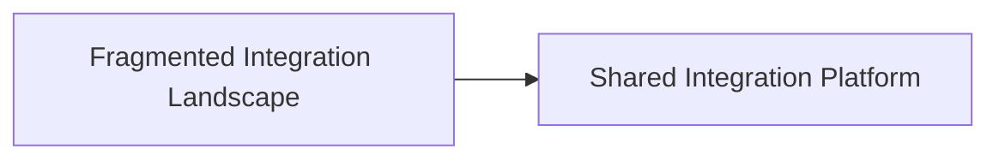
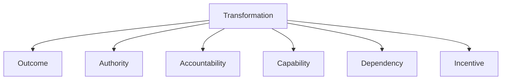
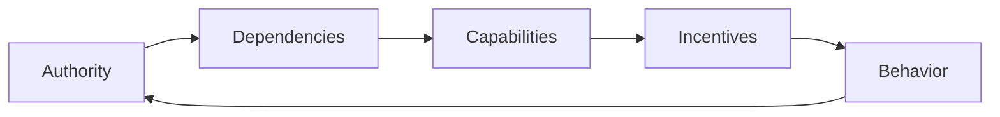

Transformation is often described as if an organization experiences one change.

A strategy is agreed. A target operating model is designed. Platforms are consolidated. Responsibilities move. New ways of working are introduced.

From the transformation program's perspective, these changes may form one coherent journey from current state to target state.

But the people involved do not experience the transformation from the perspective of the program.

They experience it from where they stand.

An executive may see strategic simplification. An architect may see reduced fragmentation. A platform team may see greater responsibility. A product team may see another dependency. An engineer may see constraints on choices that were previously local.

They are participating in the same transformation.

They are not necessarily experiencing the same change.

> **A transformation may be one initiative on a roadmap, but it is not one change. Every role experiences a different transformation.**

This matters because what organizations describe as resistance may sometimes be a rational response to how the transformation redistributes authority, accountability, capability, dependency, risk, and incentives.

Understanding that difference does not mean avoiding difficult change.

It means understanding the change we are actually asking people to make.

## There Is No Single Transformation

Consider an organization that wants to replace several locally managed integration solutions with a shared integration platform.

The enterprise case may be compelling:

- Fewer duplicated technologies
- Stronger security controls
- Reusable integration capabilities
- Lower operational complexity
- Clearer technology ownership
- Reduced long-term cost

From an enterprise perspective, the direction appears straightforward.



But this diagram hides most of the transformation.

For technology leadership, the change may mean reducing fragmentation and improving control.

For architecture, it may mean establishing clearer patterns and boundaries.

For the platform team, it may mean becoming responsible for a service that many more teams depend on.

For a product team, it may mean replacing technology it already understands with a platform it does not control.

For developers, it may mean learning new tooling and giving up implementation choices that were previously local.

For operations, it may introduce new concentration risk.

For finance, the organization may incur migration and platform costs long before consolidation produces savings.

The target architecture is the same.

The transformation is not.

## The Target State Hides the Journey

Architecture is good at describing structural change.

Current-state and target-state views can show which applications disappear, which platforms become strategic, where responsibilities move, and which capabilities should become shared.

Those views are necessary.

But they can make transformation appear cleaner than it is.

```text
Current State
     ↓
Transition
     ↓
Target State
```

The middle box contains much of the actual organizational change.

Teams may need to maintain old and new platforms simultaneously. Someone must perform migrations that produce little immediate product value. Responsibilities may move before capabilities are ready. People may need to learn new skills while continuing to deliver existing commitments.

A target state describes where the organization wants to arrive.

It does not automatically describe what the journey means for everyone required to get there.

## Resistance Is Information

When transformation becomes difficult, resistance is a tempting explanation.

> The teams don't want to change.

Sometimes that may be true.

But the label can also hide useful information.

Suppose a product team resists migrating to the shared integration platform.

From the transformation program's perspective, the team is delaying standardization.

From the team's perspective, the situation may look different.

Their current solution works.

Their roadmap contains customer commitments.

The migration consumes capacity without creating an immediate customer outcome.

The new platform introduces a dependency on another team.

And after migration, they may remain accountable for their product while having less control over one of the components required to operate it.

Resistance in that situation is not difficult to explain.

> **Resistance can be evidence of a mismatch between the transformation's intended benefits and its distributed consequences.**

That does not mean the migration should be cancelled.

Enterprise benefits sometimes justify local costs.

But those costs should be visible rather than interpreted simply as unwillingness to change.

## What Changes From Where You Stand?

A transformation changes more than technology and processes.

It can redistribute several things simultaneously.

### Outcome

What becomes better from this role's perspective?

An enterprise platform may reduce total organizational cost while providing little direct benefit to the first product team required to migrate.

Benefits that are obvious at one level may be invisible at another.

### Authority

What can the role decide before and after the transformation?

Standardization often deliberately moves decisions.

A team that previously selected its own integration technology may now need to work within platform guardrails.

That may be the correct architectural direction.

It is still a reduction in local decision authority.

### Accountability

What outcomes must the role answer for?

A platform team may gain responsibility for a strategically important capability without receiving enough capacity, mandate, or operational support to provide it reliably.

Transformation can therefore create the same problem that appears elsewhere in governance:

> Accountability without sufficient authority.

### Capability

What must the role learn, build, or stop doing?

A transformation may require new engineering practices, domain knowledge, operating capabilities, vendor-management skills, or leadership behaviors.

A box moving on an operating-model diagram can represent months of capability development for the people inside it.

### Dependency

Who does the role become more or less dependent on?

Centralization can reduce duplication while increasing dependency.

A shared platform may simplify the enterprise landscape while making twenty product teams dependent on one platform team's priorities and reliability.

That is not necessarily an argument against the platform.

It is an architectural consequence that needs to be designed for.

### Incentive

Does the transformation align with how the role is measured?

A product team may be measured on product outcomes while being asked to spend significant capacity on an enterprise migration.

The enterprise receives the benefit.

The team absorbs the cost.

If incentives remain local while transformation benefits are enterprise-wide, resistance should not be surprising.

## The Transformation Lens

These perspectives can be turned into a simple lens.

For any role materially affected by a transformation, ask:

| Lens | Question |
|---|---|
| **Outcome** | What becomes better or worse from this role's perspective? |
| **Authority** | What decisions does this role gain or lose? |
| **Accountability** | What outcomes will this role now answer for? |
| **Capability** | What must this role learn, build, or stop doing? |
| **Dependency** | Who does this role become more or less dependent on? |
| **Incentive** | Does the change align with how this role is measured and rewarded? |



The purpose is not to create another stakeholder template.

It is to change the question.

Instead of asking:

> How do we convince this stakeholder?

Ask:

> **What transformation are we actually asking this stakeholder to undergo?**

The difference matters.

The first question assumes the transformation is understood and the remaining problem is adoption.

The second allows the transformation itself to be examined.

## Different Perspectives Can Both Be Correct

Transformations often create disagreements where both sides have legitimate arguments.

Architecture may say:

> We need one strategic integration platform to reduce fragmentation.

A product team may say:

> Moving to that platform will make our delivery dependent on another team's roadmap.

Both can be correct.

Leadership may say:

> Consolidation will reduce operating cost.

Operations may say:

> Consolidation also concentrates operational risk.

Both can be correct.

A platform team may say:

> Standardization allows us to provide better self-service capabilities.

Developers may say:

> Standardization removes flexibility we currently use to solve local problems.

Again, both can be correct.

The purpose of architecture and transformation leadership should not be to make these tensions disappear rhetorically.

It should be to make them explicit enough to decide which trade-offs the organization is willing to make.

## Local Loss Can Create Enterprise Value

One of the harder realities of transformation is that not every participant has to benefit equally.

Sometimes an organization should deliberately make something harder locally because doing so creates greater value elsewhere.

A team may lose freedom to select technology because the organization needs fewer technologies to operate.

A business unit may lose a customized process because a common process enables shared capabilities.

A platform team may accept greater responsibility because centralizing a capability reduces duplication across dozens of teams.

The mistake is not necessarily creating these asymmetries.

The mistake is pretending they do not exist.

If a transformation creates enterprise value by imposing local cost, that cost should be recognized, funded, prioritized, and governed accordingly.

Otherwise the organization effectively asks one part of the system to subsidize another while describing its reluctance as resistance.

## Not All Resistance Should Be Removed

There is another reason to take resistance seriously.

Sometimes it reveals a flaw in the transformation itself.

A security team may identify that consolidation creates unacceptable concentration risk.

A product team may expose that the proposed platform cannot support an important customer need.

Operations may discover that the target architecture lacks a workable recovery model.

An engineer may know that a supposedly obsolete component supports behavior absent from the replacement.

Treating every objection as something to overcome removes an important feedback mechanism.

The goal should therefore not be zero resistance.

It should be the ability to distinguish between:

```text
Preference
Constraint
Local optimization
Missing capability
Misaligned incentive
Unmanaged risk
Structural problem
```

Some should be challenged.

Some should be accommodated.

Some should change the transformation.

## Transformation Changes Decision Rights

Many transformations implicitly change who gets to decide.

Moving from independent product technologies to shared platforms changes technology decision rights.

Creating common data ownership changes who can define information.

Centralizing procurement changes vendor authority.

Introducing product-oriented operating models changes prioritization and funding decisions.

Yet these changes are often presented primarily as process or technology changes.

That can leave the new decision model ambiguous.

A team is told it remains autonomous but discovers that several previously local decisions now belong to a platform, domain, security function, or enterprise authority.

The organizational chart may barely change.

The decision architecture has changed substantially.

This is why transformation and decision rights cannot be treated separately.

If authority is being redistributed, that redistribution should be explicit.

## Architecture Can Make the Consequences Visible

Architecture has an important role in transformation, but it should not own every aspect of the change.

Architects can make structural consequences visible.

They can identify new dependencies, changing boundaries, duplicated capabilities, concentration risks, transitional states, and decisions that move between organizational levels.

They can also expose when a target architecture requires an operating-model change that has not yet been acknowledged.

But architecture should be careful not to confuse architectural coherence with organizational feasibility.

> **A better target architecture does not make its consequences insignificant.**

A shared platform may still be the right answer even if teams dislike migrating to it.

The architectural contribution is to make the trade-off visible: what improves, what becomes constrained, where dependencies move, and which new capabilities are required.

The organization can then make the decision deliberately.

## Transformation Is a System Change

This leads to a broader view of transformation.

Transformation is not simply moving an organization from one designed state to another.

Changing one part of the organization changes the conditions experienced by others.



Centralizing a decision may create a new dependency.

The dependency may require a new platform capability.

The platform capability may change team incentives.

Those incentives may change behavior.

The changed behavior may eventually require another adjustment to authority.

Transformation is therefore less like installing a new organizational design and more like changing a system whose parts respond to one another.

The target state matters.

So do the responses created on the way there.

## Final Thoughts

Transformation is often communicated as a common journey toward a shared destination.

The destination may be shared.

The journey is not.

Different roles experience different changes in authority, accountability, capability, dependency, incentives, workload, and risk.

Some will gain autonomy.

Others will lose it.

Some will receive new capabilities.

Others will become responsible for providing them.

Some will see benefits immediately.

Others may carry costs whose benefits appear somewhere else in the organization.

That does not make transformation impossible.

It makes perspective part of the architecture of change.

Resistance should therefore not automatically be treated as something to overcome. It can provide information about consequences that the transformation has not yet made visible.

The useful question is not only:

> **Why won't they change?**

It is:

> **What does this change actually mean from where they stand?**