Organizations often describe transformation as movement between two states.

There is a current state.

There is a target state.

And between them sits a transformation plan.

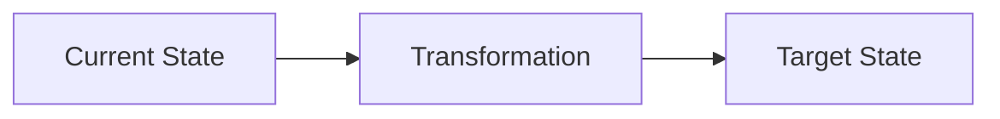

This is useful for describing direction.

It is less useful for understanding how organizations actually change.

Organizations do not remain passive while a transformation is implemented. Teams respond to new incentives. Managers reinterpret priorities. Platforms create new dependencies. Customers behave differently. Regulation changes. Local decisions alter the conditions assumed by the original plan.

The organization observes some of these effects and responds again.

Change creates behavior.

Behavior creates outcomes.

Outcomes create new information.

That information influences the next change.

A better model therefore looks less like a transition between two static states and more like a system with feedback.

> **An operating model does more than distribute work. It determines how the organization senses change, who can respond, which actions are available, and how quickly the consequences become visible.**

In that sense, the operating model is part of the organization's control system.

## From Target State to Feedback Loop

Consider a simple transformation.

An organization wants to reduce duplicated technology. Leadership establishes a strategic platform and asks product teams to migrate.

The intended transformation looks straightforward:

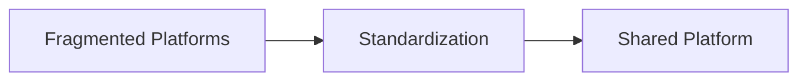

But implementation changes the organization.

Product teams become dependent on the platform team.

The platform team receives more demand.

Its backlog grows.

Delivery times increase.

Product teams begin creating workarounds.

Architecture observes new fragmentation.

Management responds with stronger platform governance.

That changes team behavior again.

The transformation has become a feedback loop.

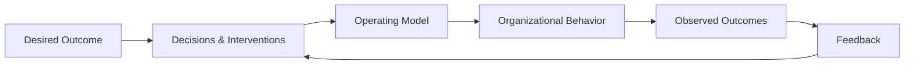

The target still matters.

But so does the mechanism through which the organization observes the difference between what it wanted and what actually happened.

## The Control-System Analogy

Control theory provides a useful vocabulary for thinking about this.

The analogy should not be taken literally. Organizations are social systems, not machines. Their goals are ambiguous, people interpret signals, causality is difficult to isolate, and behavior itself changes in response to measurement.

But the analogy exposes something that static operating-model diagrams often hide: **feedback, delay, response, and adaptation**.

A simplified mapping might look like this:

| Control system | Organization |
|---|---|
| Reference / setpoint | Desired outcome or strategic direction |
| Controller | Governance and decision mechanisms |
| Plant | Operating organization |
| Control input | Decisions, priorities, funding, policies, guardrails |
| Output | Actual organizational outcomes |
| Sensor | Metrics, observations, customer feedback |
| Disturbance | Markets, regulation, incidents, competitors |
| Feedback | Learning that influences subsequent decisions |

The interesting part is not whether every control-theory term maps perfectly.

It does not.

The useful question is what the analogy reveals about organizational design.

## Open-Loop Transformation

Some transformations are effectively operated as open-loop systems.

Leadership establishes a target state.

A program defines the activities required to reach it.

The organization executes the plan.

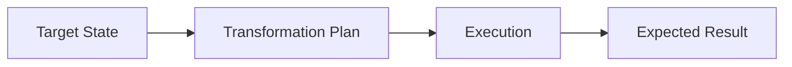

The underlying assumption is that sufficiently good planning will produce the intended outcome.

Feedback may exist through status reports, steering committees, milestones, and project metrics, but much of it answers:

> Are we executing the plan?

rather than:

> Is the system responding as we expected?

Those are different questions.

A platform migration can be 80 percent complete while creating dependencies that make product delivery slower.

A reorganization can be completed on schedule while leaving decision authority less clear than before.

A new governance process can achieve 100 percent compliance while increasing lead time without materially reducing risk.

Execution evidence tells us whether the intervention happened.

It does not necessarily tell us whether the intervention produced the desired system behavior.

## Closed-Loop Transformation

A closed-loop view treats the transformation as a hypothesis.

We intervene.

We observe what happens.

We compare the outcome with what we intended.

Then we adjust.

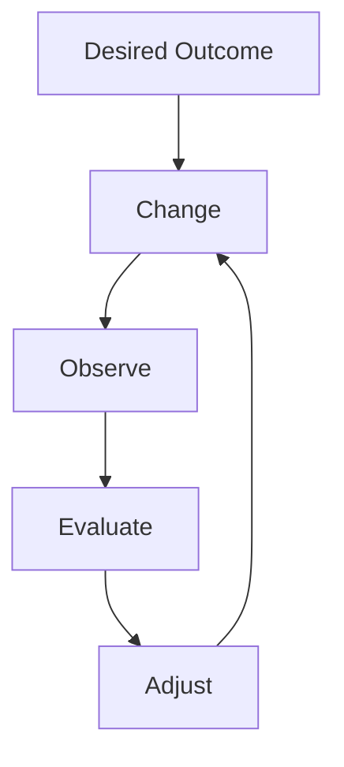

This does not mean abandoning strategic direction whenever a metric moves.

It means acknowledging that the relationship between organizational intervention and organizational outcome is uncertain.

The target provides direction.

Feedback provides information.

Decision rights determine who can respond.

The operating model determines how quickly that response can happen.

## Feedback Without Authority Is Just Information

Organizations often invest heavily in sensing mechanisms.

Dashboards.

Employee surveys.

Customer metrics.

Architecture assessments.

Operational telemetry.

Risk reports.

Retrospectives.

These improve visibility.

But sensing is only one part of a control system.

Suppose a platform team sees that its lead time has doubled because demand from product teams has increased dramatically.

The information is available.

But the team cannot increase capacity, change its service model, reject demand, alter priorities, or delegate capabilities to product teams.

The organization has successfully detected the problem.

It has not created an effective feedback loop.

> **Feedback without authority is just information.**

For feedback to change organizational behavior, someone must have both the responsibility and the authority to act on it.

This connects operating-model design directly to decision rights.

## Designing a Feedback Loop

A feedback loop needs more than measurement.

For an organizational feedback loop to work, several things need to connect:

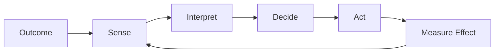

### Define the Outcome

Start with the behavior or outcome the organization is trying to influence.

Not:

> Adopt the shared platform.

But:

> Reduce the cost and lead time of delivering integrations without increasing operational risk.

The distinction matters because platform adoption is an intervention. It is not necessarily the desired outcome.

If the organization measures only adoption, it can successfully execute the transformation while making the underlying system worse.

### Decide What to Sense

The organization needs signals that reveal whether the system is moving in the intended direction.

For a shared platform, these might include delivery lead time, platform demand, reliability, exceptions, workarounds, adoption, support load, and product-team dependency.

No individual measure describes the system.

Together they provide signals about its behavior.

### Put Interpretation Close to Context

A signal does not explain itself.

An increase in platform exceptions could mean that teams are avoiding standards.

It could also mean that the platform is missing an important capability.

The people interpreting the signal therefore need enough context to distinguish symptoms from causes.

This is where qualitative feedback matters alongside metrics.

### Assign Decision Authority

Someone must be able to respond.

If everyone can observe a problem but nobody can change priorities, funding, guardrails, platform capabilities, or decision rights, the loop remains open.

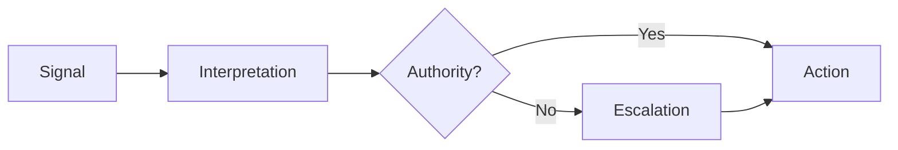

The escalation path is part of the feedback loop, not an exception to it.

### Make Interventions Explicit

When the organization responds, it should be possible to distinguish the intervention from the outcome.

For example:

> Platform lead time is increasing.

The organization decides to introduce self-service provisioning.

That creates a testable relationship:

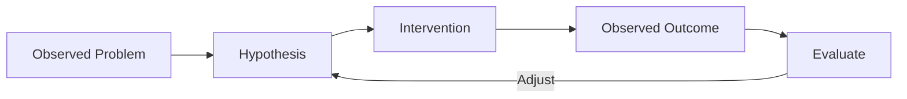

Now the organization can ask whether self-service actually reduced lead time rather than simply recording that self-service was delivered.

### Allow Enough Time to Observe the Response

The feedback interval should reflect how quickly the system can reasonably respond.

Operational metrics may provide useful feedback within hours.

A platform change may take weeks.

A change in decision rights may take months before its effects become visible.

Reacting faster than the system can respond creates noise and encourages overcorrection.

> **The cadence of governance should reflect the response time of the system being governed.**

A useful feedback-loop design can therefore be summarized as:

| Element | Question |
|---|---|
| **Outcome** | What are we actually trying to change? |
| **Signal** | What tells us whether it is happening? |
| **Interpretation** | Who can understand what the signal means? |
| **Authority** | Who can respond? |
| **Action** | What can they change? |
| **Delay** | When should we expect an effect? |
| **Learning** | How does the result change the next decision? |

A feedback loop is therefore not a dashboard, a retrospective, or a governance meeting. Those may be components of one.

The loop only closes when observation can lead to an authorized intervention, the consequences of that intervention can be observed, and what is learned influences the next decision.

## Delay Changes Everything

One of the most important properties of a control system is delay.

Organizations contain enormous amounts of it.

A decision is made today.

Teams interpret it over the following weeks.

Funding changes next quarter.

People are recruited.

Systems are migrated.

New behaviors emerge.

Customers eventually experience the result.

Metrics finally reveal whether the intervention worked.

The feedback loop may take months.

This creates a dangerous temptation.

When the expected result does not appear quickly enough, another intervention is introduced.

Then another.

Consider a familiar cycle:

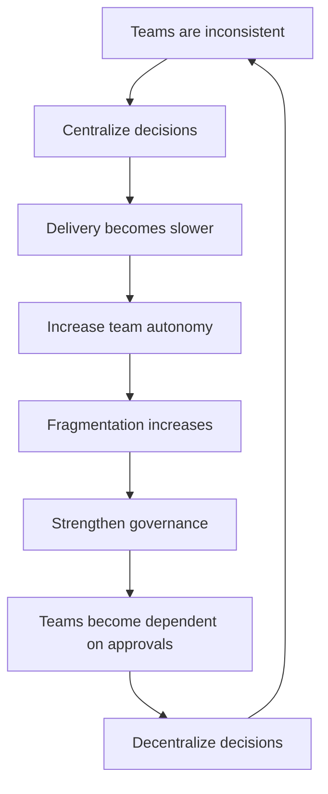

Each intervention may be understandable.

Together they can produce oscillation.

The organization keeps correcting itself without allowing enough time to understand the effect of the previous correction.

> **Organizations can become unstable when the rate of intervention exceeds the rate at which the effects of previous interventions can be observed.**

This is one reason repeated reorganizations can be so disruptive.

The organization may still be adapting to the previous operating model when the next one arrives.

## Stronger Intervention Is Not Always Better Control

When outcomes move away from expectations, organizations often respond by increasing control.

More governance.

More reporting.

More approvals.

More standards.

More centralization.

This may reduce variation.

It may also create new delays and dependencies.

Imagine that architecture quality varies significantly between teams.

One response is to require central architecture approval for every significant design.

Initially, consistency may improve.

But the central function now receives more decisions.

Queues grow.

Teams wait.

Architects become involved earlier because teams fear late rejection.

Eventually even relatively local decisions begin flowing through the central function.

The attempt to increase control has changed the dynamics of the system.

More intervention has not necessarily created better control.

It may simply have increased the gain of the controller.

## Local Control Can Produce Global Problems

Modern organizations rarely have one controller.

They have many.

Product teams optimize customer outcomes and delivery speed.

Platform teams optimize reliability, reuse, and standardization.

Security functions optimize exposure and control effectiveness.

Finance optimizes cost and capital allocation.

Operations optimizes stability.

Architecture optimizes coherence and long-term optionality.

Each can behave rationally from its own perspective.

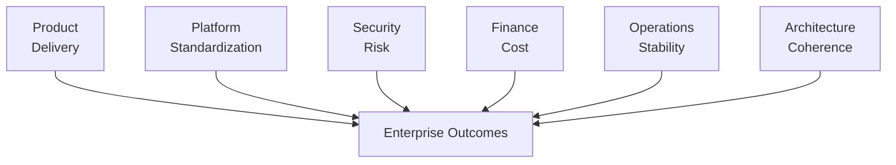

The problem is that locally sensible control loops can interact.

A product team optimizes lead time by bypassing a shared platform.

Architecture responds to fragmentation by introducing stronger standards.

The platform team responds to demand by limiting supported use cases.

Product teams create more exceptions.

Governance responds with an exception process.

Every participant may be behaving rationally.

The system-level result may still be poor.

This is why organizational optimization cannot be reduced to making every individual function more effective at achieving its own objectives.

The interactions matter.

## Measures Become Part of the System

Measurement is not passive either.

Once a metric influences decisions, people respond to the metric.

If teams are measured primarily on delivery speed, they may avoid work whose benefits appear elsewhere.

If a platform team is measured on availability, it may resist changes that increase operational uncertainty.

If architecture is measured on standards compliance, it may optimize for conformity rather than business outcomes.

If transformation is measured on migration completion, teams may technically migrate while preserving old structures underneath.

The sensor has begun influencing the system it is observing.

This makes organizational feedback fundamentally different from measuring temperature in a room.

People interpret measurement.

They anticipate consequences.

They adapt behavior.

The design of metrics is therefore part of the operating model itself.

## Disturbances Are Normal

Transformation plans often implicitly assume a relatively stable environment.

Reality provides disturbances.

A competitor launches a new product.

Regulation changes.

A major customer leaves.

An acquisition introduces another technology landscape.

A security incident changes risk tolerance.

A supplier changes pricing.

AI changes the economics of software delivery.

These are not exceptional events outside the operating model.

Responding to them is one of the reasons the operating model exists.

A resilient operating model therefore needs more than an optimized target structure.

It needs the ability to detect meaningful change and adapt without requiring the entire organization to be redesigned each time the environment moves.

## Guardrails Change the Control Mechanism

This also provides another way to understand the difference between gates and guardrails.

A gate controls individual decisions directly:

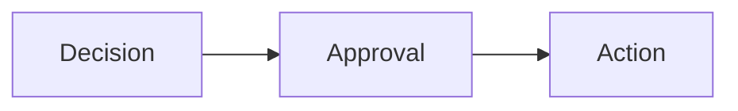

A guardrail changes the conditions under which decentralized decisions can be made:

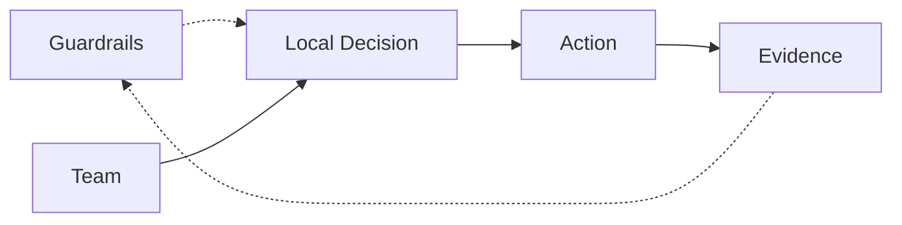

The first mechanism depends on central intervention.

The second attempts to shape local behavior while preserving local control.

Neither is always correct.

High-risk, irreversible decisions may justify explicit approval.

Frequent, reversible decisions usually benefit from being made closer to the relevant information.

The operating-model question is therefore not simply:

> Should we centralize or decentralize?

It is:

> **Which feedback loops need central authority, and which can safely close locally?**

## Architecture Is Part of the Feedback System

Architecture is often described through artifacts.

Principles.

Target architectures.

Standards.

Roadmaps.

Decision records.

These matter.

But architecture also participates in organizational feedback.

Architects observe recurring local decisions and identify patterns.

They see when several teams solve the same problem independently.

They identify when a platform creates unintended dependencies.

They notice when an exception is becoming a de facto standard.

They connect local behavior to consequences that may only become visible elsewhere.

That information can influence guardrails, platform capabilities, investment priorities, and decision rights.

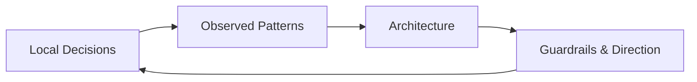

Architecture therefore does not need to control every decision to influence the system.

Its value may be greater when it improves the quality of the feedback loop.

## The Operating Model Determines the Loop

An operating model is often described through organizational structures, roles, processes, capabilities, governance, and technology.

Those elements also determine how feedback moves.

For any important organizational outcome, we can ask:

| Question | Operating-model implication |
|---|---|
| What are we trying to achieve? | Strategic direction |
| What can we observe? | Metrics and sensing |
| Who interprets the signal? | Accountability |
| Who can respond? | Decision authority |
| What actions are available? | Capabilities and guardrails |
| How quickly can action occur? | Organizational latency |
| When do we escalate? | Governance |
| How do we know whether it worked? | Feedback |

This provides another lens for operating-model design.

Do not only map who performs the work.

Map how the organization **senses, decides, acts, and learns**.

## Designing for Adaptation

The goal of an operating model should not be to eliminate variation or continuously force the organization toward a perfectly defined state.

Organizations operate in environments that change faster than any target model can remain accurate.

The stronger design objective is therefore adaptability.

Can teams detect problems close to where they occur?

Can they act without unnecessary escalation?

Are enterprise consequences visible when local decisions create wider effects?

Can authority move when the scope of a decision changes?

Can feedback alter guardrails without requiring a complete governance redesign?

Can the organization distinguish a temporary disturbance from a structural change?

These properties determine whether the organization can continuously correct itself without constantly reorganizing.

## Final Thoughts

A target operating model describes a desired arrangement.

It does not explain how that arrangement will respond when reality differs from the assumptions used to design it.

That requires feedback.

Organizations continuously sense their environment, make decisions, observe consequences, and respond again.

Sometimes the loops are explicit.

Often they are not.

Poorly designed loops create delays, hidden dependencies, overcorrection, conflicting local optimization, and repeated organizational oscillation.

Well-designed loops allow decisions to happen close to relevant knowledge while still making wider consequences visible.

The operating model therefore does more than determine where responsibilities sit.

It determines **how the organization senses change, who can respond, what they are allowed to change, and how quickly the organization can learn from the result.**

In that sense:

> **The operating model is a control system.**